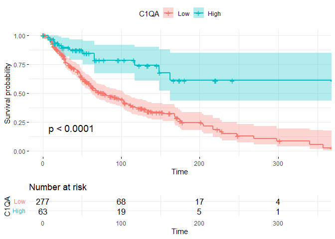
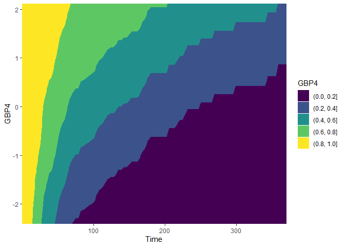
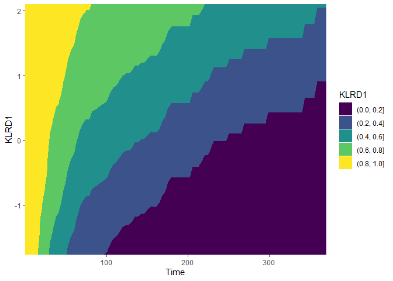
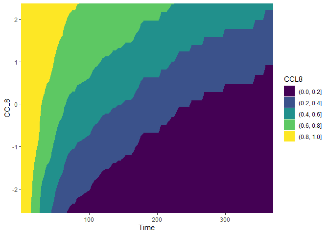
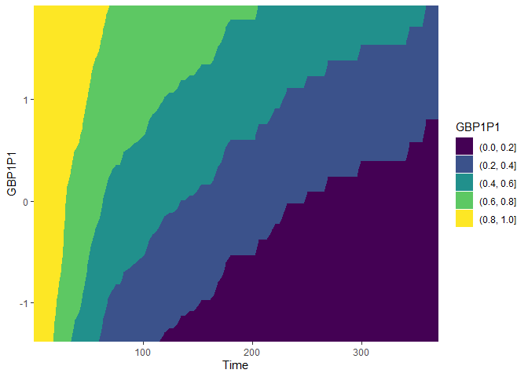
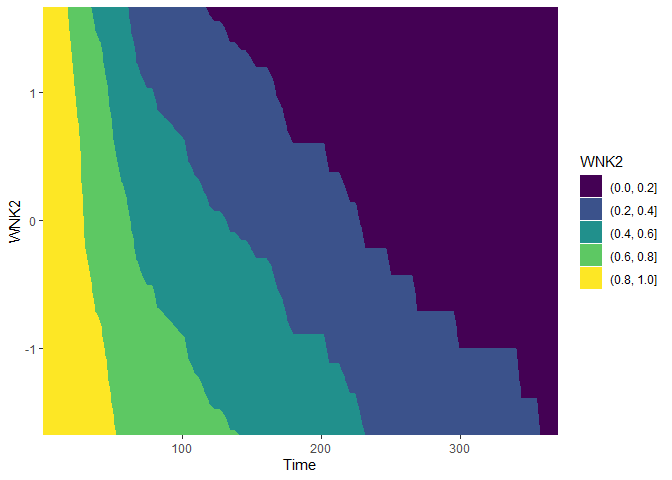

``` r
library(dplyr)
library(survival)
library(data.table)
library(tibble)
library(readr)
library(org.Hs.eg.db)
library(AnnotationDbi)
library(contsurvplot)
library(ggplot2)
library(riskRegression)
library(pammtools)
library(survminer)
```

## 1. PREPARE INITIAL DATA

1.1 clinical sample and clinical patient data

``` r
samples <- read.delim("data_clinical_sample.txt", skip = 4)
patients <- read.delim("data_clinical_patient.txt", skip = 4)

patients <- patients %>%
    dplyr::select(PATIENT_ID, OS_STATUS, OS_MONTHS, DSS_STATUS, AGE, SEX) %>%
    filter(!(DSS_STATUS == "0:ALIVE OR DEAD TUMOR FREE" & OS_STATUS == "1:DECEASED")) %>%
    dplyr::select(!"DSS_STATUS") %>%
    na.omit() %>%
    mutate(OS_STATUS = ifelse(OS_STATUS == "1:DECEASED", 1, 0))

samples <- samples %>%
    dplyr::select(PATIENT_ID, SAMPLE_ID, SAMPLE_TYPE)
```

1.2 clinical metastasis and all clinical

``` r
meta_clin <- inner_join(patients, samples, by = "PATIENT_ID") %>%
    filter(SAMPLE_TYPE == "Metastasis") %>%
    filter(SAMPLE_ID != "TCGA-GN-A269-01")

clin <- inner_join(patients, samples, by = "PATIENT_ID")
```

1.3 trascriptomic data

``` r
transcriptomic <- read_tsv("data_mrna_seq_v2_rsem.txt", show_col_types = FALSE)
transcriptomic <- transcriptomic %>%
    dplyr::select(-Hugo_Symbol) %>%
    distinct(transcriptomic$Entrez_Gene_Id, .keep_all = TRUE)

colnames(transcriptomic)[1] <- "ENTREZID"
```

1.4 change entrez id to official symbols

``` r
annots <- AnnotationDbi::select(org.Hs.eg.db, keys = as.character(transcriptomic$ENTREZID),
    columns = c("SYMBOL"), keytype = "ENTREZID")

annots$ENTREZID <- as.double(annots$ENTREZID)

RNA_symb <- inner_join(annots, transcriptomic, by = "ENTREZID")

RNA_symb <- RNA_symb %>%
    dplyr::select(!"ENTREZID")
```

1.5 transpose, log and scaling

``` r
RNA <- transpose(RNA_symb[-1])

colnames(RNA) <- RNA_symb$SYMBOL

rownames(RNA) <- colnames(RNA_symb)[-1]

RNA <- log2(RNA[-1] + 1)

RNA <- apply(RNA, 2, function(x) (x - median(x))/mad(x))

RNA <- as.data.frame(RNA)

RNA <- rownames_to_column(RNA, "SAMPLE_ID")
```

1.6 collect data

``` r
RNA_meta <- inner_join(meta_clin, RNA, by = "SAMPLE_ID")

RNA_clin <- inner_join(clin, RNA, by = "SAMPLE_ID")
```

## 2 UNIVARIATE ANALYSIS OF OS

### molecular signatures from articles

founded

-   SUCO - 51430
-   BTN3A1 - 11119
-   GZMB - 3002
-   C1QA - 712
-   C1QB - 713
-   LINC02908 - C9orf139 - 401563
-   MIR3667HG - C22orf34 - 348645
-   CCL4 - 6351
-   CXCL10 - 3627
-   CCL5 - 6352

not founded

-   MIR17 - hsa-miR-17-5p - 406952
-   HLA-DQB1-AS1 - 106480429

### molecular signatures from Olga’s work

founded

-   KLRD1 - 3824
-   GBP4 - 115361
-   OCA2 - 4948
-   CCL8 - 6355
-   GBP1P1 - 400759
-   HSPA7 - 3311
-   WNK2 - 65268

2.1 create df for a forest plot

2.1.1 articles

``` r
covariates1 <- c("SUCO", "BTN3A1", "GZMB", "C1QA", "C1QB", "LINC02908", "MIR3667HG",
    "CCL4", "CXCL10", "CCL5")
univ_formulas1 <- sapply(covariates1, function(x) as.formula(paste("Surv(OS_MONTHS,OS_STATUS)~",
    x)))

univ_models1 <- lapply(univ_formulas1, function(x) {
    coxph(x, data = RNA_meta)
})
univ_results1 <- lapply(univ_models1, function(x) {
    x <- summary(x)
    p.value <- signif(x$wald["pvalue"], digits = 4)
    wald.test <- signif(x$wald["test"], digits = 4)
    beta <- signif(x$coef[1], digits = 4)
    HR <- signif(x$coef[2], digits = 4)
    HR.confint.lower <- signif(x$conf.int[, "lower .95"], 4)
    HR.confint.upper <- signif(x$conf.int[, "upper .95"], 4)
    res <- c(beta, HR, HR.confint.lower, HR.confint.upper, wald.test, p.value)

    names(res) <- c("B values", "HR", "lower", "upper", "wald.test", "p.value")
    return(res)
})
res1 <- t(as.data.frame(univ_results1, check.names = FALSE))
df1 <- as.data.frame(res1)
df1 <- rownames_to_column(df1, "MS")
```

2.2.2. Olga’s work

``` r
covariates2 <- c("KLRD1", "GBP4", "OCA2", "CCL8", "GBP1P1", "HSPA7", "WNK2")
univ_formulas2 <- sapply(covariates2, function(x) as.formula(paste("Surv(OS_MONTHS,OS_STATUS)~",
    x)))

univ_models2 <- lapply(univ_formulas2, function(x) {
    coxph(x, data = RNA_meta)
})
univ_results2 <- lapply(univ_models2, function(x) {
    x <- summary(x)
    p.value <- signif(x$wald["pvalue"], digits = 4)
    wald.test <- signif(x$wald["test"], digits = 4)
    beta <- signif(x$coef[1], digits = 4)
    HR <- signif(x$coef[2], digits = 4)
    HR.confint.lower <- signif(x$conf.int[, "lower .95"], 4)
    HR.confint.upper <- signif(x$conf.int[, "upper .95"], 4)
    res <- c(beta, HR, HR.confint.lower, HR.confint.upper, wald.test, p.value)

    names(res) <- c("B values", "HR", "lower", "upper", "wald.test", "p.value")
    return(res)
})
res2 <- t(as.data.frame(univ_results2, check.names = FALSE))
df2 <- as.data.frame(res2)
df2 <- rownames_to_column(df2, "MS")
```

2.2 create df for a comparative table

2.2.1 articles

``` r
univ_formulas3 <- sapply(covariates1, function(x) as.formula(paste("Surv(OS_MONTHS,OS_STATUS)~",
    x)))

univ_models3 <- lapply(univ_formulas3, function(x) {
    coxph(x, data = RNA_meta)
})
univ_results3 <- lapply(univ_models3, function(x) {
    x <- summary(x)
    p.value <- signif(x$wald["pvalue"], digits = 4)
    wald.test <- signif(x$wald["test"], digits = 4)
    beta <- signif(x$coef[1], digits = 4)
    HR <- signif(x$coef[2], digits = 4)
    HR.confint.lower <- signif(x$conf.int[, "lower .95"], 4)
    HR.confint.upper <- signif(x$conf.int[, "upper .95"], 4)
    HR <- paste0(HR, " (", HR.confint.lower, "-", HR.confint.upper, ")")
    res <- c(beta, HR, wald.test, p.value)

    names(res) <- c("B values", "HR (95% CI)", "wald.test", "p.value")
    return(res)
})

res3 <- t(as.data.frame(univ_results3, check.names = FALSE))
table3 <- as.data.frame(res3)
table3 <- rownames_to_column(table3, "MS")
table3
```

    ##           MS B values            HR (95% CI) wald.test   p.value
    ## 1       SUCO   -0.184 0.8319 (0.7252-0.9543)      6.91   0.00858
    ## 2     BTN3A1  -0.3912 0.6762 (0.5829-0.7845)     26.64 2.455e-07
    ## 3       GZMB  -0.3606 0.6973 (0.5925-0.8205)     18.85 1.415e-05
    ## 4       C1QA  -0.3208 0.7256 (0.6308-0.8346)     20.17 7.095e-06
    ## 5       C1QB  -0.2808 0.7552 (0.6622-0.8612)     17.54 2.806e-05
    ## 6  LINC02908  -0.4597 0.6315 (0.5267-0.7571)     24.66 6.824e-07
    ## 7  MIR3667HG  -0.3713 0.6898 (0.5848-0.8137)     19.42 1.047e-05
    ## 8       CCL4  -0.4195 0.6574 (0.5587-0.7734)     25.57 4.257e-07
    ## 9     CXCL10  -0.4185  0.658 (0.5658-0.7652)     29.54 5.476e-08
    ## 10      CCL5  -0.3269  0.7211 (0.6235-0.834)     19.41 1.057e-05

2.2.2 Olga’s work

``` r
univ_formulas4 <- sapply(covariates2, function(x) as.formula(paste("Surv(OS_MONTHS,OS_STATUS)~",
    x)))
univ_models4 <- lapply(univ_formulas4, function(x) {
    coxph(x, data = RNA_meta)
})
univ_results4 <- lapply(univ_models4, function(x) {
    x <- summary(x)
    p.value <- signif(x$wald["pvalue"], digits = 4)
    wald.test <- signif(x$wald["test"], digits = 4)
    beta <- signif(x$coef[1], digits = 4)
    HR <- signif(x$coef[2], digits = 4)
    HR.confint.lower <- signif(x$conf.int[, "lower .95"], 4)
    HR.confint.upper <- signif(x$conf.int[, "upper .95"], 4)
    HR <- paste0(HR, " (", HR.confint.lower, "-", HR.confint.upper, ")")
    res <- c(beta, HR, wald.test, p.value)

    names(res) <- c("B values", "HR (95% CI)", "wald.test", "p.value")
    return(res)
})

res4 <- t(as.data.frame(univ_results4, check.names = FALSE))
table4 <- as.data.frame(res4)
table4 <- rownames_to_column(table4, "MS")
table4
```

    ##       MS B values            HR (95% CI) wald.test   p.value
    ## 1  KLRD1  -0.4911  0.612 (0.5145-0.7279)      30.8 2.859e-08
    ## 2   GBP4   -0.431 0.6498 (0.5612-0.7526)     33.15 8.552e-09
    ## 3   OCA2   0.5241    1.689 (1.363-2.093)     22.92 1.685e-06
    ## 4   CCL8  -0.4348 0.6474 (0.5599-0.7485)     34.48 4.307e-09
    ## 5 GBP1P1  -0.4956  0.6092 (0.5112-0.726)     30.68 3.048e-08
    ## 6  HSPA7   -0.398 0.6716 (0.5752-0.7842)     25.33 4.823e-07
    ## 7   WNK2    0.377    1.458 (1.216-1.748)     16.53 4.781e-05

2.3 forest plot

2.3.1. articles

``` r
ggplot(data = df1, aes(y = MS, x = HR, xmin = lower, xmax = upper)) + geom_point() +
    geom_errorbarh(height = 0.1) + geom_vline(xintercept = 1, color = "black", linetype = "dashed",
    alpha = 0.5) + labs(x = "HR", y = "Molecular signatures") + theme_minimal()
```


2.3.2. Olga’s work

``` r
ggplot(data = df2, aes(y = MS, x = HR, xmin = lower, xmax = upper)) + geom_point() +
    geom_errorbarh(height = 0.1) + geom_vline(xintercept = 1, color = "black", linetype = "dashed",
    alpha = 0.5) + labs(x = "HR", y = "Molecular signatures") + theme_minimal()
```


2.4 Kaplan-Meier plot

``` r
survplotdata <- RNA_meta[, c("OS_MONTHS", "OS_STATUS", "SUCO", "BTN3A1", "GZMB",
    "C1QA", "C1QB", "LINC02908", "MIR3667HG", "CCL4", "CXCL10", "CCL5", "KLRD1",
    "GBP4", "OCA2", "CCL8", "GBP1P1", "HSPA7", "WNK2")]
survplotdata <- as.data.frame(survplotdata)
head(survplotdata)
```

    ##   OS_MONTHS OS_STATUS        SUCO     BTN3A1        GZMB        C1QA
    ## 1  17.02995         1  0.53901145 -1.0577325 -1.58426997 -1.98472771
    ## 2  66.47598         0  0.28212418  2.7008991  0.78475682  1.26388495
    ## 3  12.98616         1 -0.02883024  0.2211178  0.55518741 -0.36097009
    ## 4  14.92586         0 -0.76074930  0.3879637  1.06848731  1.05069500
    ## 5  16.56968         1  0.98523700 -0.6512922 -1.39372424 -0.73050400
    ## 6  16.66831         1 -0.16590960  0.4497229 -0.03634102  0.02566226
    ##           C1QB   LINC02908  MIR3667HG         CCL4     CXCL10       CCL5
    ## 1 -2.141540817 -0.97929858 -0.8771318 -2.233110762 -1.5627838 -1.5690206
    ## 2  1.198640920  1.18641885  0.5843431  1.301758937  0.8521455  1.1237814
    ## 3 -0.547182516  0.89537756 -0.1441991  0.440121529  0.8220713  0.2623614
    ## 4  0.983536042  1.53654266  0.4623454  1.269623340  1.1151800  1.3504766
    ## 5 -0.797796424 -1.31172969 -0.4288178 -0.566819507 -1.1777638 -1.3070525
    ## 6 -0.001243528 -0.01251474  0.4869298  0.002281663 -0.2052363 -0.1889793
    ##        KLRD1        GBP4       OCA2       CCL8     GBP1P1       HSPA7
    ## 1 -1.4241701 -1.83232025  0.4883830 -1.3546030 -1.0641278 -0.98254986
    ## 2  1.1484730  1.88854881 -0.2633976  1.7600083  1.9200092  1.15892496
    ## 3  0.1061393  0.04755221  0.2152346  0.1454400  0.8417351 -0.05680452
    ## 4  1.2112416  0.65185751 -0.2130410  0.4032514  0.7057522  0.67255210
    ## 5 -1.1014079 -0.96759216  0.5066726 -0.8005246 -1.0922229 -1.34113503
    ## 6 -0.1664183  0.12692019 -0.2394895 -0.9038850  0.4309559 -0.99468870
    ##         WNK2
    ## 1  0.4572784
    ## 2  0.9573319
    ## 3  1.5611410
    ## 4 -0.2300390
    ## 5 -0.2559178
    ## 6 -0.2407623

2.4.1 articles

``` r
Expr <- 1
for (x in c("SUCO", "BTN3A1", "GZMB", "C1QA", "C1QB", "LINC02908", "MIR3667HG", "CCL4",
    "CXCL10", "CCL5")) {
    survplotdata[[x]] <- ifelse(survplotdata[[x]] >= Expr, "High", "Low")
    survplotdata[[x]] <- factor(survplotdata[[x]], levels = c("Low", "High"))
}


for (x in c("SUCO", "BTN3A1", "GZMB", "C1QA", "C1QB", "LINC02908", "MIR3667HG", "CCL4",
    "CXCL10", "CCL5")) {
    plot <- ggsurvplot(survfit(Surv(OS_MONTHS, OS_STATUS) ~ survplotdata[[x]], data = survplotdata),
        data = survplotdata, break.time.by = 100, pval = TRUE, legend.labs = c("Low",
            "High"), ggtheme = theme_minimal(), xlim = c(0, 350), conf.int = TRUE,
        risk.table = TRUE, legend.title = x)
    print(plot)
}
```



2.4.2 Olga’s work

``` r
Expr <- 1
for (x in c("KLRD1", "GBP4", "OCA2", "CCL8", "GBP1P1", "HSPA7", "WNK2")) {
    survplotdata[[x]] <- ifelse(survplotdata[[x]] >= Expr, "High", "Low")
    survplotdata[[x]] <- factor(survplotdata[[x]], levels = c("Low", "High"))
}


for (x in c("KLRD1", "GBP4", "OCA2", "CCL8", "GBP1P1", "HSPA7", "WNK2")) {
    plot <- ggsurvplot(survfit(Surv(OS_MONTHS, OS_STATUS) ~ survplotdata[[x]], data = survplotdata),
        data = survplotdata, break.time.by = 100, pval = TRUE, legend.labs = c("Low",
            "High"), ggtheme = theme_minimal(), xlim = c(0, 350), conf.int = TRUE,
        risk.table = TRUE, legend.title = x)
    print(plot)
}
```

 +
plot_surv_contour (Olga’s work)

``` r
survplotdata <- RNA_meta[, c("OS_MONTHS", "OS_STATUS", "SUCO", "BTN3A1", "GZMB",
    "C1QA", "C1QB", "LINC02908", "MIR3667HG", "CCL4", "CXCL10", "CCL5", "KLRD1",
    "GBP4", "OCA2", "CCL8", "GBP1P1", "HSPA7", "WNK2")]
survplotdata <- as.data.frame(survplotdata)
survplotdata <- as.data.frame(apply(survplotdata, 2, as.numeric))
```

``` r
model <- coxph(Surv(OS_MONTHS, OS_STATUS) ~ GBP4, data = survplotdata, x = TRUE)
plot_surv_contour(model = model, time = "OS_MONTHS", status = "OS_STATUS", variable = "GBP4",
    data = survplotdata, legend.title = "GBP4", bins = 5)
```



``` r
model <- coxph(Surv(OS_MONTHS, OS_STATUS) ~ KLRD1, data = survplotdata, x = TRUE)
plot_surv_contour(model = model, time = "OS_MONTHS", status = "OS_STATUS", variable = "KLRD1",
    data = survplotdata, legend.title = "KLRD1", bins = 5)
```



``` r
model <- coxph(Surv(OS_MONTHS, OS_STATUS) ~ OCA2, data = survplotdata, x = TRUE)
plot_surv_contour(model = model, time = "OS_MONTHS", status = "OS_STATUS", variable = "OCA2",
    data = survplotdata, legend.title = "OCA2", bins = 5)
```


``` r
model <- coxph(Surv(OS_MONTHS, OS_STATUS) ~ CCL8, data = survplotdata, x = TRUE)
plot_surv_contour(model = model, time = "OS_MONTHS", status = "OS_STATUS", variable = "CCL8",
    data = survplotdata, legend.title = "CCL8", bins = 5)
```



``` r
model <- coxph(Surv(OS_MONTHS, OS_STATUS) ~ GBP1P1, data = survplotdata, x = TRUE)
plot_surv_contour(model = model, time = "OS_MONTHS", status = "OS_STATUS", variable = "GBP1P1",
    data = survplotdata, legend.title = "GBP1P1", bins = 5)
```



``` r
model <- coxph(Surv(OS_MONTHS, OS_STATUS) ~ HSPA7, data = survplotdata, x = TRUE)
plot_surv_contour(model = model, time = "OS_MONTHS", status = "OS_STATUS", variable = "HSPA7",
    data = survplotdata, legend.title = "HSPA7", bins = 5)
```


``` r
model <- coxph(Surv(OS_MONTHS, OS_STATUS) ~ WNK2, data = survplotdata, x = TRUE)
plot_surv_contour(model = model, time = "OS_MONTHS", status = "OS_STATUS", variable = "WNK2",
    data = survplotdata, legend.title = "WNK2", bins = 5)
```


