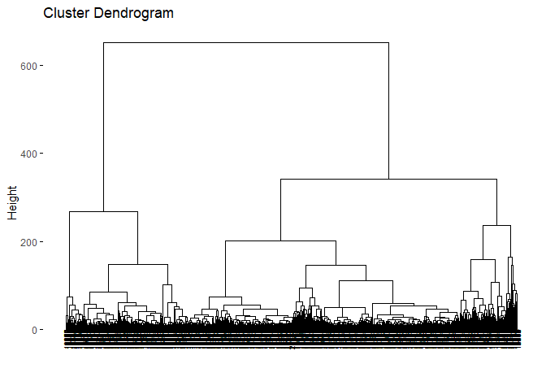
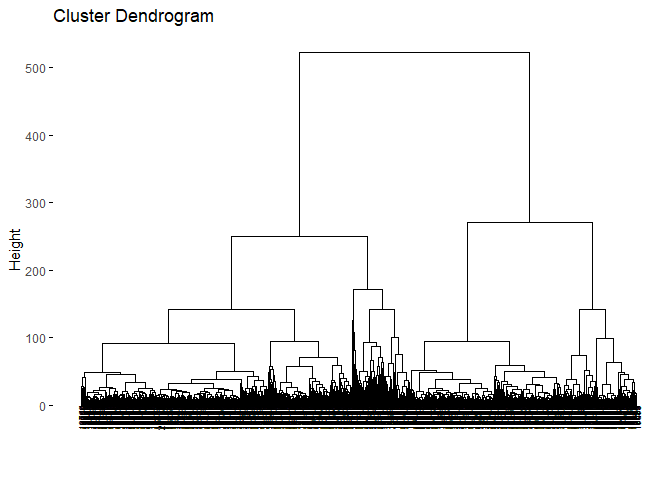
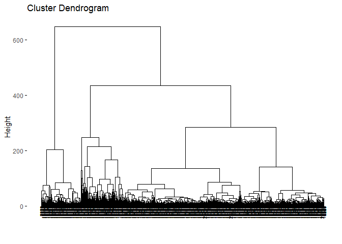

Clustering
================
Шавронская Дарья Олеговна
2022-12-06

подгрузим библиотеки

``` r
library(factoextra)
```

    ## Loading required package: ggplot2

    ## Welcome! Want to learn more? See two factoextra-related books at https://goo.gl/ve3WBa

``` r
library(dplyr)
```

    ## 
    ## Attaching package: 'dplyr'

    ## The following objects are masked from 'package:stats':
    ## 
    ##     filter, lag

    ## The following objects are masked from 'package:base':
    ## 
    ##     intersect, setdiff, setequal, union

``` r
library(purrr)
```

считаем данные из txt

``` r
clinical_p <- read.delim2("data_clinical_patient.txt")
colnames(clinical_p) <- clinical_p[4,] 
clinical_p <- slice(clinical_p , -c(1:4))


clinical_s <-read.delim("data_clinical_sample.txt")
colnames(clinical_s) <- clinical_s[4,] 
clinical_s <- slice(clinical_s, -c(1:4))


mrna <-read.delim("data_mrna_seq_v2_rsem.txt") %>%
  select(- Hugo_Symbol)
```

объдиним клинические данные

``` r
clinical <- clinical_p %>%
  full_join(clinical_s, by = c("PATIENT_ID"="PATIENT_ID"))
#str(clinical)

#clinical %>%
#  map(table, useNA = "always")
```

логарифмируем данные

``` r
mrna_log2 <- log(mrna[-1]+ 1, base = 2)
mrna_log2_full <- cbind(mrna[1],mrna_log2)
dim(mrna_log2_full)
```

    ## [1] 20531   444

отфильтруем наиболее экспрессируемые гены

``` r
keep <- rowSums(mrna_log2_full > 12) > 444/10
mrna_log2_filtered <- mrna_log2_full[keep, ]
```

проведем кластеризацию

``` r
mrna_log2_filtered_scaled <- scale(mrna_log2_filtered)
mrna_log2_filtered_scaled_dist <- dist(mrna_log2_filtered_scaled, method = "euclidean")
hc_mrna <- hclust(mrna_log2_filtered_scaled_dist, 
                        method = "ward.D2")
fviz_dend(hc_mrna, 
          cex = 0.5)
```

    ## Warning: The `<scale>` argument of `guides()` cannot be `FALSE`. Use "none" instead as
    ## of ggplot2 3.3.4.
    ## ℹ The deprecated feature was likely used in the factoextra package.
    ##   Please report the issue at <]8;;https://github.com/kassambara/factoextra/issueshttps://github.com/kassambara/factoextra/issues]8;;>.

<!-- -->
модифицируем данные

``` r
modified_sd = function(x){
  return((x-mean(x))/sd(x))
}
mrna_log2_sd <-apply(mrna_log2, 2, modified_sd)

mrna_log2_sd_full <- cbind(mrna_log2_full[1],mrna_log2_sd)
```

отфильтруем данные

``` r
keep2 <- rowSums(mrna_log2_sd_full > 1.5) > 444/10
mrna_log2_filtered_sd <- mrna_log2_sd_full[keep2, ]
```

проведем кластеризацию и построим дендрограмму

``` r
mrna_log2_filtered_sd_scaled <- scale(mrna_log2_filtered_sd)
mrna_log2_filtered_sd_scaled_dist <- dist(mrna_log2_filtered_sd_scaled, method = "euclidean")
hc_rmna_sd <- hclust(d = mrna_log2_filtered_sd_scaled_dist, 
                       method = "ward.D2")
fviz_dend(hc_rmna_sd, 
        cex = 0.5)
```

<!-- -->

модифицируем данные

``` r
modified_mad = function(x){
  return((x - median(x))/mad(x))
}
mrna_log2_mad <-apply(mrna_log2, 2, modified_mad)

mrna_log2_mad_full <- cbind(mrna_log2_full[1],mrna_log2_mad)
```

отфильтруем данные

``` r
keep3 <- rowSums(mrna_log2_mad_full > 1) > 444/10
mrna_log2_filtered_mad <- mrna_log2_mad_full[keep3, ]
```

проведем кластеризацию и построим дендрограмму

``` r
mrna_log2_filtered_mad_scaled <- scale(mrna_log2_filtered_mad)
mrna_log2_filtered_mad_scaled_dist <- dist(mrna_log2_filtered_mad_scaled, method = "euclidean")
hc_mrna_mad <- hclust(mrna_log2_filtered_mad_scaled_dist, 
                    method = "ward.D2")
fviz_dend(hc_mrna_mad, 
          cex = 0.5)
```

<!-- -->
