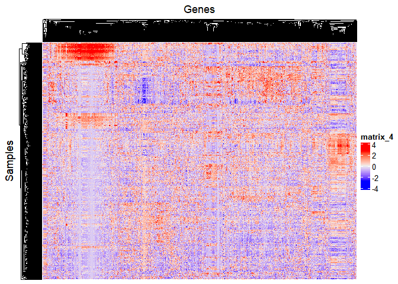
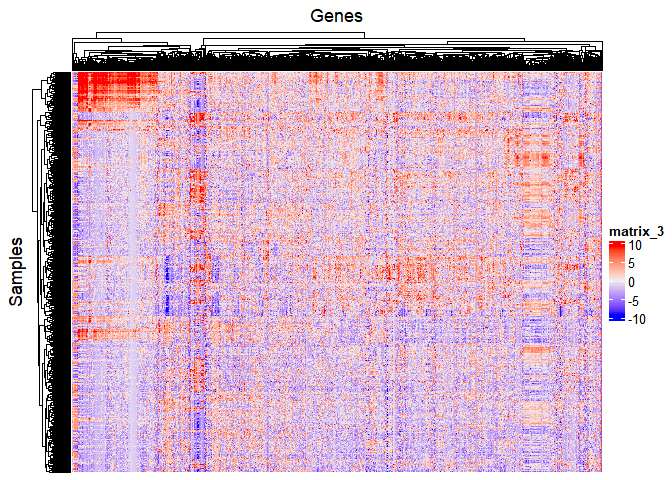
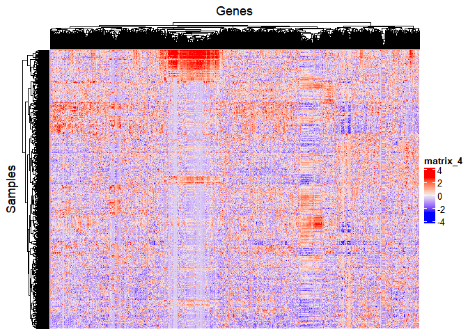
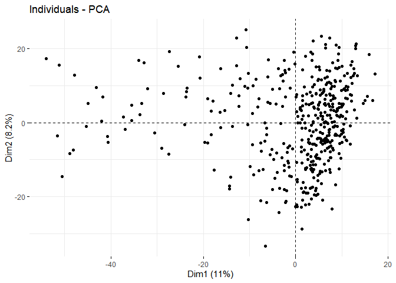
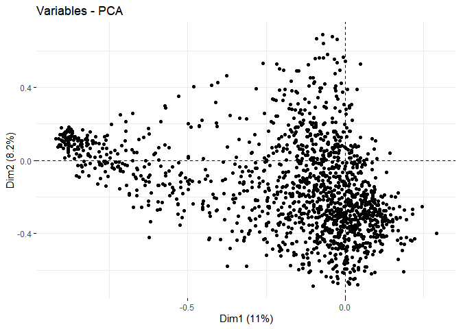

## Transcriptomics data

### Log2 (imputed values), median centered, no scaling

### Log2 (imputed values), median centered, mad scaled

### Log2 (imputed values), mean centered, no scaling

### Log2 (imputed values), mean centered, sd scaled

