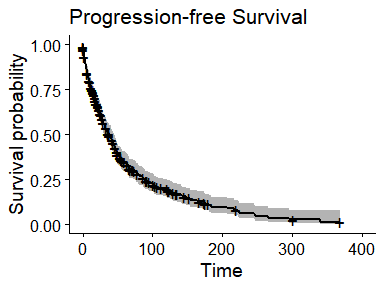

## Clinical Data

### Download sample data

### Download patient data

### Join patients and samples, remove duplicated patients

### Plot parameters

<table class="gt_table">
  
  <thead class="gt_col_headings">
    <tr>
      <th class="gt_col_heading gt_columns_bottom_border gt_left" rowspan="1" colspan="1" scope="col"><strong>Characteristic</strong></th>
      <th class="gt_col_heading gt_columns_bottom_border gt_center" rowspan="1" colspan="1" scope="col"><strong>N = 367</strong>1</th>
    </tr>
  </thead>
  <tbody class="gt_table_body">
    <tr><td class="gt_row gt_left">TISSUE_PROSPECTIVE_COLLECTION_INDICATOR</td>
<td class="gt_row gt_center">109 (30%)</td></tr>
    <tr><td class="gt_row gt_left">TISSUE_RETROSPECTIVE_COLLECTION_INDICATOR</td>
<td class="gt_row gt_center">258 (70%)</td></tr>
    <tr><td class="gt_row gt_left">SAMPLE_TYPE</td>
<td class="gt_row gt_center"></td></tr>
    <tr><td class="gt_row gt_left">    Metastasis</td>
<td class="gt_row gt_center">367 (100%)</td></tr>
    <tr><td class="gt_row gt_left">SEX</td>
<td class="gt_row gt_center"></td></tr>
    <tr><td class="gt_row gt_left">    Female</td>
<td class="gt_row gt_center">138 (38%)</td></tr>
    <tr><td class="gt_row gt_left">    Male</td>
<td class="gt_row gt_center">229 (62%)</td></tr>
    <tr><td class="gt_row gt_left">AJCC_PATHOLOGIC_TUMOR_STAGE</td>
<td class="gt_row gt_center"></td></tr>
    <tr><td class="gt_row gt_left">    STAGE 0</td>
<td class="gt_row gt_center">7 (2.1%)</td></tr>
    <tr><td class="gt_row gt_left">    STAGE I</td>
<td class="gt_row gt_center">29 (8.7%)</td></tr>
    <tr><td class="gt_row gt_left">    STAGE I/II (NOS)</td>
<td class="gt_row gt_center">13 (3.9%)</td></tr>
    <tr><td class="gt_row gt_left">    STAGE IA</td>
<td class="gt_row gt_center">18 (5.4%)</td></tr>
    <tr><td class="gt_row gt_left">    STAGE IB</td>
<td class="gt_row gt_center">28 (8.4%)</td></tr>
    <tr><td class="gt_row gt_left">    STAGE II</td>
<td class="gt_row gt_center">26 (7.8%)</td></tr>
    <tr><td class="gt_row gt_left">    STAGE IIA</td>
<td class="gt_row gt_center">14 (4.2%)</td></tr>
    <tr><td class="gt_row gt_left">    STAGE IIB</td>
<td class="gt_row gt_center">19 (5.7%)</td></tr>
    <tr><td class="gt_row gt_left">    STAGE IIC</td>
<td class="gt_row gt_center">15 (4.5%)</td></tr>
    <tr><td class="gt_row gt_left">    STAGE III</td>
<td class="gt_row gt_center">39 (12%)</td></tr>
    <tr><td class="gt_row gt_left">    STAGE IIIA</td>
<td class="gt_row gt_center">15 (4.5%)</td></tr>
    <tr><td class="gt_row gt_left">    STAGE IIIB</td>
<td class="gt_row gt_center">35 (11%)</td></tr>
    <tr><td class="gt_row gt_left">    STAGE IIIC</td>
<td class="gt_row gt_center">54 (16%)</td></tr>
    <tr><td class="gt_row gt_left">    STAGE IV</td>
<td class="gt_row gt_center">21 (6.3%)</td></tr>
    <tr><td class="gt_row gt_left">    Unknown</td>
<td class="gt_row gt_center">34</td></tr>
    <tr><td class="gt_row gt_left">PERSON_NEOPLASM_CANCER_STATUS</td>
<td class="gt_row gt_center"></td></tr>
    <tr><td class="gt_row gt_left">    Tumor Free</td>
<td class="gt_row gt_center">142 (41%)</td></tr>
    <tr><td class="gt_row gt_left">    With Tumor</td>
<td class="gt_row gt_center">202 (59%)</td></tr>
    <tr><td class="gt_row gt_left">    Unknown</td>
<td class="gt_row gt_center">23</td></tr>
  </tbody>
  
  <tfoot class="gt_footnotes">
    <tr>
      <td class="gt_footnote" colspan="2">1 n (%)</td>
    </tr>
  </tfoot>
</table>

## Transcriptomics data
