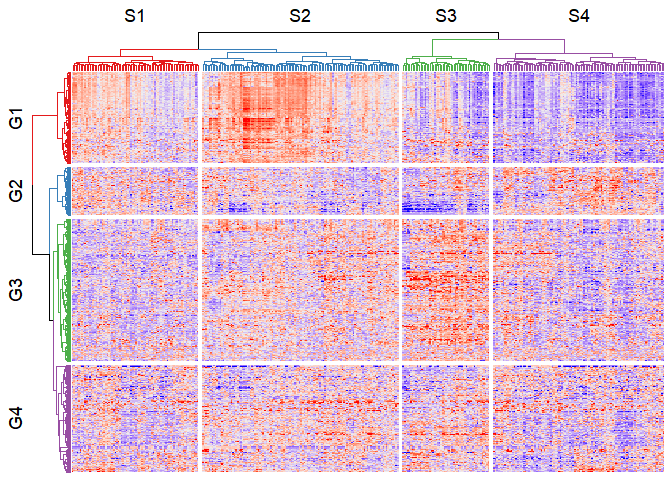
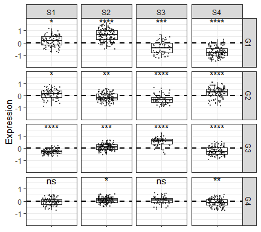
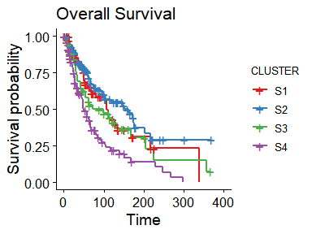
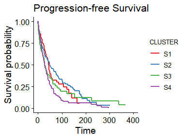
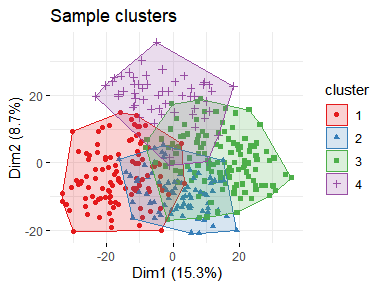
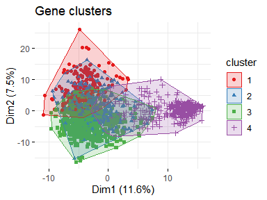

## Clinical data

## Transcriptomics data

### Quick heatmap

### Gene ontology by gene clusters

### Complete heatmap

    ## png 
    ##   2

### Simplified heatmap

    ## Call:
    ## coxph(formula = Surv(OS_MONTHS, as.numeric(as.factor(OS_STATUS))) ~ 
    ##     Expression, data = .)
    ## 
    ##   n= 352, number of events= 185 
    ##    (15 observations deleted due to missingness)
    ## 
    ##               coef exp(coef) se(coef)      z Pr(>|z|)    
    ## Expression -0.4493    0.6381   0.1023 -4.394 1.11e-05 ***
    ## ---
    ## Signif. codes:  0 '***' 0.001 '**' 0.01 '*' 0.05 '.' 0.1 ' ' 1
    ## 
    ##            exp(coef) exp(-coef) lower .95 upper .95
    ## Expression    0.6381      1.567    0.5222    0.7797
    ## 
    ## Concordance= 0.607  (se = 0.024 )
    ## Likelihood ratio test= 19.72  on 1 df,   p=9e-06
    ## Wald test            = 19.31  on 1 df,   p=1e-05
    ## Score (logrank) test = 19.63  on 1 df,   p=9e-06

    ## Call:
    ## coxph(formula = Surv(PFS_MONTHS, as.numeric(as.factor(PFS_STATUS))) ~ 
    ##     Expression, data = .)
    ## 
    ##   n= 353, number of events= 271 
    ##    (14 observations deleted due to missingness)
    ## 
    ##                coef exp(coef) se(coef)      z Pr(>|z|)  
    ## Expression -0.18082   0.83459  0.08352 -2.165   0.0304 *
    ## ---
    ## Signif. codes:  0 '***' 0.001 '**' 0.01 '*' 0.05 '.' 0.1 ' ' 1
    ## 
    ##            exp(coef) exp(-coef) lower .95 upper .95
    ## Expression    0.8346      1.198    0.7086     0.983
    ## 
    ## Concordance= 0.541  (se = 0.02 )
    ## Likelihood ratio test= 4.7  on 1 df,   p=0.03
    ## Wald test            = 4.69  on 1 df,   p=0.03
    ## Score (logrank) test = 4.7  on 1 df,   p=0.03

### Survival analysis

### PCA + clustering

