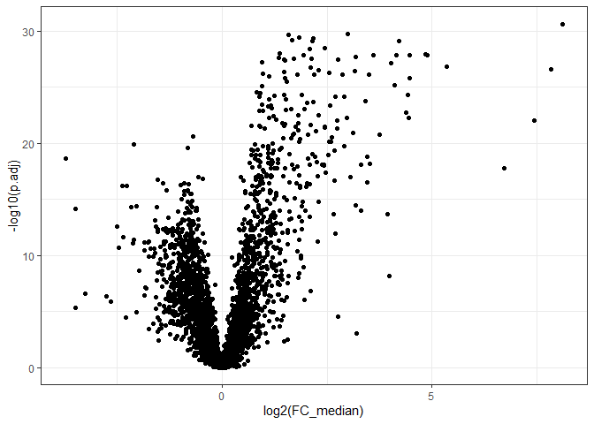

## Clinical data

Скачиваем, объединяем и чистим данные о образцах и пациентах.

    df.s <- read_tsv("../raw/data_clinical_sample.txt", skip = 4)
    df.p <- read_tsv("../raw/data_clinical_patient.txt", skip = 4)

    df.p <- dplyr::select(df.p, PATIENT_ID, AGE, SEX, RACE, ETHNICITY, AJCC_PATHOLOGIC_TUMOR_STAGE, OS_STATUS, OS_MONTHS, PFS_STATUS, PFS_MONTHS)
    df.s <- dplyr::select(df.s, PATIENT_ID, SAMPLE_ID, SAMPLE_TYPE, TMB_NONSYNONYMOUS)

    df.meta <-
      left_join(df.p, df.s) %>%
      filter(SAMPLE_TYPE == "Metastasis") %>%
      filter(SAMPLE_ID != "TCGA-GN-A269-01") %>%
      mutate(STAGE = case_when(is.na(AJCC_PATHOLOGIC_TUMOR_STAGE) ~ as.character(NA),
                               str_detect(AJCC_PATHOLOGIC_TUMOR_STAGE, "STAGE IV") ~ "STAGE III-IV",
                               str_detect(AJCC_PATHOLOGIC_TUMOR_STAGE, "STAGE III") ~ "STAGE III-IV",
                                          TRUE ~ "STAGE 0-II"))

    rm(df.s, df.p)

## Transcriptomics data

Скачиваем, предобрабатываем транскриптомные данные и кластеризуем по
1500 самым вариабельным генам.

    df.t <- 
      read_tsv("../raw/data_mrna_seq_v2_rsem.txt") %>%
      dplyr::select(-Hugo_Symbol) %>%
      dplyr::select(Entrez_Gene_Id, all_of(df.meta$SAMPLE_ID)) %>%
      distinct(Entrez_Gene_Id, .keep_all = TRUE)

    mat <- t(df.t[-1])
    colnames(mat) <- df.t$Entrez_Gene_Id
    rownames(mat) <- colnames(df.t)[-1]

    mat <- log2(mat + 1)

    features <- 
      apply(mat, 2, mad) %>%
      sort(decreasing = T) %>%
      .[1:1500] %>%
      names()

    mat <- apply(mat, 2, function(x) (x - median(x))/mad(x))

    mat.1500 <- mat[, features]

    smpl.dend <- 
      dist(mat.1500, method = "euclidian") %>%
      hclust(method = "ward.D2") %>%
      as.dendrogram()
    smpl.grp <- cutree(smpl.dend, k = 4)
    smpl.grp <- case_when(smpl.grp == 1 ~ "S4",
                     smpl.grp == 2 ~ "S1",
                     smpl.grp == 3 ~ "S2",
                     smpl.grp == 4 ~ "S3")
    names(smpl.grp) <- rownames(mat)

    rm(df.t, mat.1500)

    mat <- mat[, !apply(mat, 2, function(gene) any(is.na(gene)))]

### ssGSEA

Функция ssGSEA из [этого
источника](https://rpubs.com/pranali018/SSGSEA).

    ssgsea <- function(X, gene_sets, alpha = 0.25, scale = T, norm = F, single = T) {
        row_names <- rownames(X)
        num_genes <- nrow(X)
        gene_sets <- lapply(gene_sets, function(genes) {which(row_names %in% genes)})

        # Ranks for genes
        R <- matrixStats::colRanks(X, preserveShape = T, ties.method = 'average')

        # Calculate enrichment score (es) for each sample (column)
        es = apply(R, 2, function(R_col) {
            gene_ranks = order(R_col, decreasing = TRUE)

            # Calc es for each gene set
            es_sample = sapply(gene_sets, function(gene_set_idx) {
                # pos: match (within the gene set)
                # neg: non-match (outside the gene set)
                indicator_pos = gene_ranks %in% gene_set_idx
                indicator_neg = !indicator_pos

                rank_alpha  = (R_col[gene_ranks] * indicator_pos) ^ alpha

                step_cdf_pos = cumsum(rank_alpha)    / sum(rank_alpha)
                step_cdf_neg = cumsum(indicator_neg) / sum(indicator_neg)

                step_cdf_diff = step_cdf_pos - step_cdf_neg

                # Normalize by gene number
                if (scale) step_cdf_diff = step_cdf_diff / num_genes

                # Use ssGSEA or not
                if (single) {
                    sum(step_cdf_diff)
                } else {
                    step_cdf_diff[which.max(abs(step_cdf_diff))]
                }
            })
            unlist(es_sample)
        })

        if (length(gene_sets) == 1) es = matrix(es, nrow = 1)

        # Normalize by absolute diff between max and min
        if (norm) es = es / diff(range(es))

        # Prepare output
        rownames(es) = names(gene_sets)
        colnames(es) = colnames(X)
        return(es)
    }

Подгружаем curated gene sets (Canonical pathways), скаченные из [базы
данных](http://www.gsea-msigdb.org/gsea/msigdb/collections.jsp)

    file.name <- "../raw/c2.cp.v2022.1.Hs.entrez.csv"
    gene_sets <- 
      read.csv(file.name, header = FALSE)[, -2] %>%
      t()

    colnames(gene_sets) <- gene_sets[1, ]

    gene_sets <-
      gene_sets[-1, ] %>%
      as.data.frame() %>%
      as.list() %>%
      lapply(str_remove_all, " ") %>%
      lapply(na.omit)

Проводим ssGSEA анализ (alpha = 0.75 вместо стандартной 0.25 согласно
рекомендациям
[ssGSEAProjection](https://www.genepattern.org/modules/docs/ssGSEAProjection/4#gsc.tab=0)).

Т.к. процедура времяемкая, используем сохраненный объект, а код оставим
для истории.

    res <- ssgsea(t(mat), gene_sets, alpha = 0.75)
    saveRDS(res, "../Dima_Zubkov/ssGSEA.c2.75.rds")

Подгружаем готовый объект.

    rm(mat)
    res <- readRDS("../Dima_Zubkov/ssGSEA.c2.75.rds")

Сравним кластеры 2 и 4 и построим для этого сравнения Volcano plot.

    # res.p.value <-
    #   apply(res, 1, function(set) kruskal.test(set, smpl.grp)$p.value) %>%
    #   p.adjust(method = "fdr")
    # res.sd <- apply(res, 1, sd)

    # df.res <- tibble(`Gene Set` = rownames(res),
    #                  FC_median = apply(res, 1, function(set) median(set[smpl.grp == "S3"])/median(set[smpl.grp == "S4"])),
    #                  FC_mean = apply(res, 1, function(set) mean(set[smpl.grp == "S3"])/mean(set[smpl.grp == "S4"])),
    #                  p.value = apply(res, 1, function(set) wilcox.test(set[smpl.grp == "S3"], set[smpl.grp == "S4"])$p.value),
    #                  p.adj = p.adjust(p.value, method = "fdr"))

    df.res <- tibble(`Gene Set` = rownames(res),
                     FC_median = apply(res, 1, function(set) median(set[smpl.grp == "S2"])/median(set[smpl.grp == "S4"])),
                     FC_mean = apply(res, 1, function(set) mean(set[smpl.grp == "S2"])/mean(set[smpl.grp == "S4"])),
                     p.value = apply(res, 1, function(set) wilcox.test(set[smpl.grp == "S2"], set[smpl.grp == "S4"])$p.value),
                     p.adj = p.adjust(p.value, method = "fdr"))

    ggplot(df.res) +
      geom_point(aes(x = log2(FC_mean), y = -log10(p.adj)))

    ggplot(df.res) +
      geom_point(aes(x = log2(FC_median), y = -log10(p.adj)))

Видно, что значимо отличается непристойное число Gene Sets. Сделаем
фильтр по Fold Change и adjusted p-value. Шкалируем данные и построим
heatmap, для кластеризации образцов используя старое дерево по генам.

    features <- 
      df.res %>%
      filter(abs(log2(FC_median)) > 3) %>%
      filter(log10(p.adj) < -10) %>%
      .$`Gene Set`

    res.filtered <- t(apply(res[features, ], 1, function(x) (x - mean(x))/sd(x)))

    Heatmap(res.filtered, 
            show_row_names = T, show_column_names = F,
            name = "Gene Set expression",
            row_title = "Gene Set", column_title = "Sample",
            cluster_columns = smpl.dend,
            show_heatmap_legend = FALSE)

