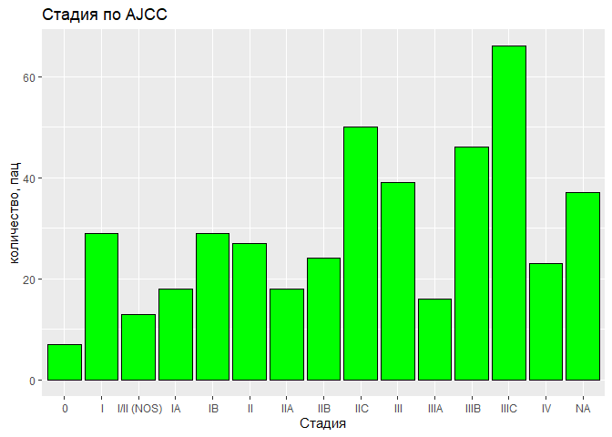

```r
library(tidyverse)
library(gtsummary)
library(factoextra)
library(ggbiplot)
library(ggplot2)
library(ggpubr)
library(dplyr)
library(plotly)
library(tibble)
library(matrixStats)
```


#Анализ клинических данных


##Пациенты


Из файла: data_clinical_patient.txt

```r
patients <- read_tsv("data_clinical_patient.txt", skip = 4)
```

```
## Rows: 442 Columns: 37
## ── Column specification ────────────────────────────────────────────────────────
## Delimiter: "\t"
## chr (28): PATIENT_ID, SUBTYPE, CANCER_TYPE_ACRONYM, OTHER_PATIENT_ID, SEX, A...
## dbl  (6): AGE, DAYS_TO_INITIAL_PATHOLOGIC_DIAGNOSIS, WEIGHT, OS_MONTHS, DSS_...
## lgl  (3): PRIMARY_LYMPH_NODE_PRESENTATION_ASSESSMENT, DFS_STATUS, DFS_MONTHS
## 
## ℹ Use `spec()` to retrieve the full column specification for this data.
## ℹ Specify the column types or set `show_col_types = FALSE` to quiet this message.
```

```r
skimr::skim(patients)
```


Table: Data summary

|                         |         |
|:------------------------|:--------|
|Name                     |patients |
|Number of rows           |442      |
|Number of columns        |37       |
|_______________________  |         |
|Column type frequency:   |         |
|character                |28       |
|logical                  |3        |
|numeric                  |6        |
|________________________ |         |
|Group variables          |None     |


**Variable type: character**

|skim_variable                           | n_missing| complete_rate| min| max| empty| n_unique| whitespace|
|:---------------------------------------|---------:|-------------:|---:|---:|-----:|--------:|----------:|
|PATIENT_ID                              |         0|          1.00|  12|  12|     0|      442|          0|
|SUBTYPE                                 |        79|          0.82|   4|   4|     0|        1|          0|
|CANCER_TYPE_ACRONYM                     |         0|          1.00|   4|   4|     0|        1|          0|
|OTHER_PATIENT_ID                        |         0|          1.00|  36|  36|     0|      442|          0|
|SEX                                     |         0|          1.00|   4|   6|     0|        2|          0|
|AJCC_PATHOLOGIC_TUMOR_STAGE             |        37|          0.92|   7|  16|     0|       14|          0|
|AJCC_STAGING_EDITION                    |        15|          0.97|   3|   3|     0|        7|          0|
|DAYS_LAST_FOLLOWUP                      |       155|          0.65|   1|  11|     0|      271|          0|
|DAYS_TO_BIRTH                           |         0|          1.00|   5|  11|     0|      430|          0|
|ETHNICITY                               |        12|          0.97|  18|  22|     0|        2|          0|
|FORM_COMPLETION_DATE                    |         0|          1.00|   6|   8|     0|      113|          0|
|HISTORY_NEOADJUVANT_TRTYN               |         0|          1.00|   2|   3|     0|        2|          0|
|ICD_10                                  |         0|          1.00|   3|   6|     0|       45|          0|
|ICD_O_3_HISTOLOGY                       |         0|          1.00|   6|   6|     0|        9|          0|
|ICD_O_3_SITE                            |         0|          1.00|   5|   5|     0|       44|          0|
|INFORMED_CONSENT_VERIFIED               |         0|          1.00|   3|   3|     0|        1|          0|
|NEW_TUMOR_EVENT_AFTER_INITIAL_TREATMENT |        13|          0.97|   2|   3|     0|        2|          0|
|PATH_M_STAGE                            |        28|          0.94|   2|   3|     0|        5|          0|
|PATH_N_STAGE                            |        21|          0.95|   2|   3|     0|       10|          0|
|PATH_T_STAGE                            |        29|          0.93|   2|   3|     0|       15|          0|
|PERSON_NEOPLASM_CANCER_STATUS           |        26|          0.94|  10|  10|     0|        2|          0|
|PRIOR_DX                                |         0|          1.00|   2|   3|     0|        2|          0|
|RACE                                    |         8|          0.98|   5|  25|     0|        3|          0|
|RADIATION_THERAPY                       |         7|          0.98|   2|   3|     0|        2|          0|
|IN_PANCANPATHWAYS_FREEZE                |         0|          1.00|   2|   3|     0|        2|          0|
|OS_STATUS                               |         7|          0.98|   8|  10|     0|        2|          0|
|DSS_STATUS                              |        13|          0.97|  17|  26|     0|        2|          0|
|PFS_STATUS                              |         7|          0.98|  10|  13|     0|        2|          0|


**Variable type: logical**

|skim_variable                              | n_missing| complete_rate| mean|count |
|:------------------------------------------|---------:|-------------:|----:|:-----|
|PRIMARY_LYMPH_NODE_PRESENTATION_ASSESSMENT |       442|             0|  NaN|:     |
|DFS_STATUS                                 |       442|             0|  NaN|:     |
|DFS_MONTHS                                 |       442|             0|  NaN|:     |


**Variable type: numeric**

|skim_variable                        | n_missing| complete_rate|  mean|    sd| p0|   p25|   p50|   p75|   p100|hist  |
|:------------------------------------|---------:|-------------:|-----:|-----:|--:|-----:|-----:|-----:|------:|:-----|
|AGE                                  |         8|          0.98| 57.52| 15.71| 15| 47.00| 58.00| 70.00|  90.00|▂▃▇▇▃ |
|DAYS_TO_INITIAL_PATHOLOGIC_DIAGNOSIS |         8|          0.98|  0.00|  0.00|  0|  0.00|  0.00|  0.00|   0.00|▁▁▇▁▁ |
|WEIGHT                               |       208|          0.53| 82.02| 19.24| 40| 70.00| 81.00| 90.00| 161.00|▃▇▃▁▁ |
|OS_MONTHS                            |        15|          0.97| 62.67| 64.18|  0| 18.31| 41.56| 80.94| 369.92|▇▂▁▁▁ |
|DSS_MONTHS                           |        15|          0.97| 62.67| 64.18|  0| 18.31| 41.56| 80.94| 369.92|▇▂▁▁▁ |
|PFS_MONTHS                           |        14|          0.97| 43.37| 54.66|  0|  9.57| 24.85| 51.88| 368.77|▇▁▁▁▁ |


*Всего пациентов 442*


Описание файла:

* PATIENT_ID	-	идентификатор пациента (TCGA-3N-A9WC)
* SUBTYPE		-	название проекта (SKCM)
* CANCER_TYPE_ACRONYM -	TCGA PanCanAtlas аббревиатура типа рака (SKCM)
* OTHER_PATIENT_ID -	Устаревший идентификатор пациента DMP
* AGE		-	возраст когда болезнь впервые диагностирована
* SEX		-	пол
* AJCC_PATHOLOGIC_TUMOR_STAGE - Степень злокачественности по критериям AJCC (STAGE IIIA)
* AJCC_STAGING_EDITION -	Издание публикации Американского объединенного комитета по борьбе с раком (7TH)
* DAYS_LAST_FOLLOWUP -	Количество дней от даты последнего наблюдения до даты первоначальной постановки диагноза (387)
* DAYS_TO_BIRTH	-	Количество дней от дня рождения до дня первоначально поставленного диагноза (-30163)
* DAYS_TO_INITIAL_PATHOLOGIC_DIAGNOSIS - Количество дней от последнего дня когда чел был жив (известно), до даты первоначального диагноза (0)
* ETHNICITY	-	этническая характеристика (Not Hispanic Or Latino)
* FORM_COMPLETION_DATE -	дата заполнения формы (5/29/14)
* HISTORY_NEOADJUVANT_TRTYN - неадъювантное лечение (т.е. с помощью ЛП) пациента до резекции опухоли (No)
* ICD_10		-	классификация ICD-10 (C44.9) типо международная классификация болезней
* ICD_O_3_HISTOLOGY -	международная классификация онко заболеваний: гистологический код (8720/3)
* ICD_O_3_SITE	-	международная классификация онко заболеваний: site код (C77.3)
* INFORMED_CONSENT_VERIFIED - есть ли информированное согласие (Yes)
* NEW_TUMOR_EVENT_AFTER_INITIAL_TREATMENT - была ли у пациента новая опухоль после первоначального лечения (Yes)
* PATH_M_STAGE	-	коды метастаз (M0)
* PATH_N_STAGE	-	коды неоплайзии (NX)
* PATH_T_STAGE	-	коды опухоли (T2A)
* PERSON_NEOPLASM_CANCER_STATUS - Статус рака новообразования человека(Tumor Free)
* PRIMARY_LYMPH_NODE_PRESENTATION_ASSESSMENT - Оценка первичного расположения лимфатических узлов	ПУСТЫЕ
* PRIOR_DX	-	Предварительный диагноз (No)
* RACE		-	раса (White)
* RADIATION_THERAPY-	была ли лучевая терапия (No)
* WEIGHT		-	вес пациента (68)
* IN_PANCANPATHWAYS_FREEZE-пациентская часть анализа пути PanCan (No)
* OS_STATUS	-	общий статус выживания (1:DECEASED)
* OS_MONTHS	-	общая выживаемость в месяцах с начала диагноза (66.47598383)
* DSS_STATUS	-	статус выживаемости в зависимости от заболевания, т.е. время с момента постановки диагноза/начала лечения и заканивается в момент смерти (1:DEAD WITH TUMOR)
* DSS_MONTHS	-	месяцы к предыдущему (12.98615906)
* DFS_STATUS	-	без заболевания с начала лечения статус	ПУСТЫЕ
* DFS_MONTHS	-	месяцев	ПУСТЫЕ
* PFS_STATUS	-	статус прогрессии (1:PROGRESSION)
* PFS_MONTHS	-	выживаемость без прогресса (28.04352829)


Более наглядно про некоторые данные:


Возраст, когда поставили диагноз

```r
patients%>%
  ggplot()+
  geom_histogram(aes(x=AGE), 
                 color="black",
                 fill="#FF3390")+
  ggtitle("Распределение по возрастам")+
  labs(x="возраст, лет", y="количество, пац")
```

```
## `stat_bin()` using `bins = 30`. Pick better value with `binwidth`.
```

```
## Warning: Removed 8 rows containing non-finite values (stat_bin).
```

<!-- -->


Вес пациентов

```r
patients%>%
  ggplot()+
  geom_histogram(aes(x=WEIGHT), 
                 color="black",
                 fill="cyan")+
  ggtitle("Распределение по весу")+
  labs(x="вес, кг", y="количество, пац")
```

```
## `stat_bin()` using `bins = 30`. Pick better value with `binwidth`.
```

```
## Warning: Removed 208 rows containing non-finite values (stat_bin).
```

<!-- -->


Пол пациентов:

```r
N<-nrow(patients)

m <- patients %>%
  filter(SEX == 'Male')%>%
  nrow()/N*100

f <- patients %>%
  filter(SEX == 'Female')%>%
  nrow()/N*100

#na <- patients %>%
#  nrow()
#na <- na-m-f

df <- data.frame(
  sex = c("Male", "Female"),
  value = c(m, f)
  )

df %>%
  ggplot(
    aes(x="", y=value, fill=sex))+
  geom_bar(width = 1, stat = "identity")+
  coord_polar("y", start=0)
```

<!-- -->


Степень злокачественности по AJCC

```r
patients$AJCC_PATHOLOGIC_TUMOR_STAGE<-gsub("STAGE","",as.character(patients$AJCC_PATHOLOGIC_TUMOR_STAGE))

patients%>%
  ggplot()+
  geom_bar(aes(x=AJCC_PATHOLOGIC_TUMOR_STAGE), position="dodge", fill = "green", color = "black")+
  ggtitle("Стадия по AJCC")+
  labs(x="Стадия", y="количество, пац")
```

<!-- -->


##Образцы

Из файла: data_clinical_sample.txt

```r
samples <- read_tsv("data_clinical_sample.txt", skip = 4)
```

```
## Rows: 448 Columns: 18
## ── Column specification ────────────────────────────────────────────────────────
## Delimiter: "\t"
## chr (13): PATIENT_ID, SAMPLE_ID, ONCOTREE_CODE, CANCER_TYPE, CANCER_TYPE_DET...
## dbl  (4): ANEUPLOIDY_SCORE, MSI_SCORE_MANTIS, MSI_SENSOR_SCORE, TMB_NONSYNON...
## lgl  (1): GRADE
## 
## ℹ Use `spec()` to retrieve the full column specification for this data.
## ℹ Specify the column types or set `show_col_types = FALSE` to quiet this message.
```

```r
skimr::skim(samples)
```


Table: Data summary

|                         |        |
|:------------------------|:-------|
|Name                     |samples |
|Number of rows           |448     |
|Number of columns        |18      |
|_______________________  |        |
|Column type frequency:   |        |
|character                |13      |
|logical                  |1       |
|numeric                  |4       |
|________________________ |        |
|Group variables          |None    |


**Variable type: character**

|skim_variable                             | n_missing| complete_rate| min| max| empty| n_unique| whitespace|
|:-----------------------------------------|---------:|-------------:|---:|---:|-----:|--------:|----------:|
|PATIENT_ID                                |         0|             1|  12|  12|     0|      442|          0|
|SAMPLE_ID                                 |         0|             1|  15|  15|     0|      448|          0|
|ONCOTREE_CODE                             |         0|             1|   4|   4|     0|        1|          0|
|CANCER_TYPE                               |         0|             1|   8|   8|     0|        1|          0|
|CANCER_TYPE_DETAILED                      |         0|             1|  18|  18|     0|        1|          0|
|TUMOR_TYPE                                |         0|             1|  23|  23|     0|        1|          0|
|TISSUE_PROSPECTIVE_COLLECTION_INDICATOR   |         0|             1|   2|   3|     0|        2|          0|
|TISSUE_RETROSPECTIVE_COLLECTION_INDICATOR |         0|             1|   2|   3|     0|        2|          0|
|TISSUE_SOURCE_SITE_CODE                   |         0|             1|   2|   2|     0|       25|          0|
|TUMOR_TISSUE_SITE                         |         0|             1|   5|  55|     0|       26|          0|
|SAMPLE_TYPE                               |         0|             1|   7|  10|     0|        2|          0|
|SOMATIC_STATUS                            |         0|             1|   7|   7|     0|        1|          0|
|TISSUE_SOURCE_SITE                        |         0|             1|   4|  44|     0|       25|          0|


**Variable type: logical**

|skim_variable | n_missing| complete_rate| mean|count |
|:-------------|---------:|-------------:|----:|:-----|
|GRADE         |       448|             0|  NaN|:     |


**Variable type: numeric**

|skim_variable     | n_missing| complete_rate|  mean|    sd|   p0|  p25|   p50|   p75|    p100|hist  |
|:-----------------|---------:|-------------:|-----:|-----:|----:|----:|-----:|-----:|-------:|:-----|
|ANEUPLOIDY_SCORE  |        14|          0.97| 12.99|  7.98| 0.00| 7.00| 11.00| 19.00|   35.00|▆▇▅▃▁ |
|MSI_SCORE_MANTIS  |       367|          0.18|  0.31|  0.02| 0.24| 0.30|  0.32|  0.33|    0.37|▁▂▇▇▁ |
|MSI_SENSOR_SCORE  |       367|          0.18|  0.12|  0.19| 0.00| 0.01|  0.05|  0.14|    1.03|▇▂▁▁▁ |
|TMB_NONSYNONYMOUS |         8|          0.98| 25.91| 55.65| 0.20| 7.04| 14.88| 31.39| 1052.20|▇▁▁▁▁ |


*Всего образцов 448*

Описание файла:

* PATIENT_ID	-	айдентификатор пациента (TCGA-BF-A1PX)
* SAMPLE_ID	-	айлентификатор образца	TCGA-BF-A1PX-01)
* ONCOTREE_CODE	-	Oncotree Code	http://oncotree.mskcc.org/ (SKCM)
* CANCER_TYPE	-	тип рака (Melanoma)
* CANCER_TYPE_DETAILED-	тип рака детальнее (Cutaneous Melanoma)
* TUMOR_TYPE	-	тип опухоли (Skin Cutaneous Melanoma)
* GRADE		-	Гистологическая степень новообразования (NA)
* TISSUE_PROSPECTIVE_COLLECTION_INDICATOR- Сбор тканей проспективный (Yes)
* TISSUE_RETROSPECTIVE_COLLECTION_INDICATOR-Сбор тканей ретроспективный(No)
* TISSUE_SOURCE_SITE_CODE-код откуда ткань (BF)
* TUMOR_TISSUE_SITE-	Анатомическое место опухоли (Regional Lymph Node|Trunk)
* ANEUPLOIDY_SCORE - 	Оценка анеуплоидии (9)
* SAMPLE_TYPE	- 	тип образца:i.e., normal, primary, met, recurrence (Metastasis)
* MSI_SCORE_MANTIS-	Оценка MSI MANTIS (0.2612)
* MSI_SENSOR_SCORE-	Оценка MSI, полученная с помощью датчика MSI (0.08)
* SOMATIC_STATUS	-	Соматический статус (Matched)
* TMB_NONSYNONYMOUS-	Tumor Mutational Burden = Мутационная нагрузка опухоли несинонимичный (26.33333333) - * TMB, определяемый как количество соматических мутаций на мегабазу исследуемой геномной последовательности, варьируется в зависимости от злокачественных новообразований. https://www.ncbi.nlm.nih.gov/pmc/articles/PMC7710563/
* TISSUE_SOURCE_SITE-	источник тканей образца: tissue, cell, or blood и клинические метаданные, которые затем отправляются на основной ресурс Biospecimen (Cureline)


Тип опухоли:

```r
p <- samples %>%
  filter(SAMPLE_TYPE == 'Primary')%>%
  nrow()/N

m <- samples %>%
  filter(SAMPLE_TYPE == 'Metastasis')%>%
  nrow()/N

#na <- samples %>%
#  nrow()
#na <- na-m-p

df <- data.frame(
  type = c("Primary", "Metastasis"),
  value = c(p, m)
  )

df %>%
  ggplot(
    aes(x="", y=value, fill=type))+
  geom_bar(width = 1, stat = "identity")+
  coord_polar("y", start=0)
```

<!-- -->


*Итого:*
448 образцов от 442 пациентов (у 6 пациентов доступны образцы primary и metastasis, которые различаются по ANEUPLOIDY_SCORE,	SAMPLE_TYPE,	MSI_SCORE_MANTIS,	MSI_SENSOR_SCORE,	TMB_NONSYNONYMOUS)


```r
samples$PATIENT_ID[duplicated(samples$PATIENT_ID)]
```

```
## [1] "TCGA-D9-A1X3" "TCGA-D9-A4Z6" "TCGA-ER-A19T" "TCGA-ER-A2NF" "TCGA-HR-A2OG"
## [6] "TCGA-HR-A2OH"
```
