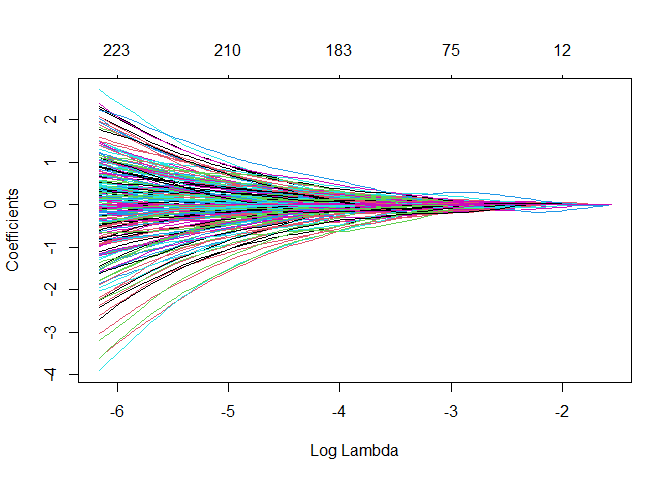
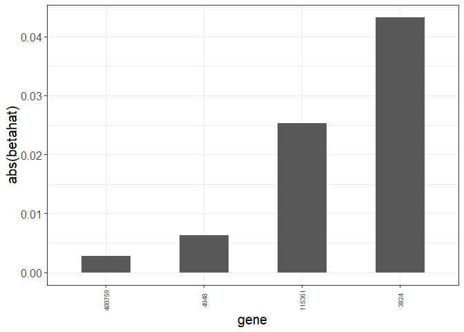

#1. OS-DSS/OS/DSS

##1.1 OS-DSS

Параметры:
OS-DSS, median/mad, mad, альфа=1


###Data-preprocessing


Данные пациентов:


Данные образцов:


```r
samples <- read_tsv("data_clinical_sample.txt", skip = 4)#исходные данные
samples <- samples %>%
  dplyr::select("PATIENT_ID", "SAMPLE_ID", "SAMPLE_TYPE")

Msamp <- samples %>%
  filter(`SAMPLE_TYPE` == "Metastasis") %>%
  dplyr::select(!"SAMPLE_TYPE")#367
colnames(Msamp) <- c("ID", "SampID")
#проверка дубликатов среди пациентов
if(length(unique(Msamp$ID)) != nrow(Msamp)){
   print("Есть дубликаты среди пациентов")
   }
```


Оставляем пациентов с метастазами:


```r
Msamp <- inner_join(Msamp, patients, by = "ID") %>%
  dplyr::select(!"ID")
```


Данные mRNA:


```r
mRNA_raw <- read_tsv("data_mrna_seq_v2_rsem.txt")
mRNA <- mRNA_raw %>%
  dplyr::select(!Hugo_Symbol)
mRNA <- mRNA[!duplicated(mRNA$Entrez_Gene_Id), ]

#транспонирование
mRNA <- t(mRNA) %>%
  as.data.frame()
colnames(mRNA) <- mRNA[1,]
mRNA$SampID <- row.names(mRNA)
mRNA <- mRNA[-1,] %>%
  dplyr::select(SampID, everything())

#оставляем только нужные образцы (метастазы)
MmRNA <- inner_join(Msamp, mRNA, by = "SampID") %>%
  dplyr::select(!c("status", "time"))
```


Оставим для анализа 1500 самых вариабельных генов и преобразуем данные:


```r
MmRNA_num <- MmRNA %>%
  dplyr::select(where(is.numeric))%>%
  dplyr::select(function(x) sum(x) != 0)%>%
  dplyr::select(function(x) mad(x) != 0)
MmRNA_transf <- log2(MmRNA_num + 1)
MmRNA_scaled <- apply(MmRNA_transf, 2, function(x) (x - median(x))/mad(x))

genes <- 
  apply(MmRNA_transf, 2, mad) %>%
  sort(decreasing = T) %>%
  .[1:1500] %>%
  names()
MmRNA_res <- MmRNA_transf[, genes]

Msurv_res <- Msamp %>%
  dplyr::select(!`SampID`)
```


###Glmnet


```r
y<-Msurv_res
x<-MmRNA_res
```


Тест и трейн сплит (20:80)

```r
set.seed(114)

indexes_tr <- sample(1:nrow(y),size=round(nrow(y)*0.8))
indexes_te <- setdiff(c(1:nrow(y)), indexes_tr)#существуют только в первом векторе

xtrain_ns <- x[indexes_tr,]
ytrain <- y[indexes_tr,]
xtest_ns <- x[indexes_te,]
ytest <- y[indexes_te,]
```


скейлим x отдельно для тест и трейн


```r
xtrain <- apply(xtrain_ns, 2, function(x) (x - median(x))/mad(x))
xtest <- apply(xtest_ns, 2, function(x) (x - median(x))/mad(x))
```


Что происходит с коэффициентами по мере роста штрафа:


```r
set.seed(89)
ytrain.surv <- Surv(ytrain$time,ytrain$status)
fit.coxnet <- glmnet(xtrain, ytrain.surv, family = "cox",alpha=1)#LASSO
plot(fit.coxnet,xvar="lambda")
```

<!-- -->


Выбор лямбды (штрафа) с помощью кросс-валидации:


```r
cv.coxnet <- cv.glmnet(xtrain,ytrain.surv,
                       family="cox",
                       type.measure="C",
                       nfolds = 5,
                       alpha=1)
plot(cv.coxnet)
```

<!-- -->

```r
cv.coxnet
```

```
## 
## Call:  cv.glmnet(x = xtrain, y = ytrain.surv, type.measure = "C", nfolds = 5,      family = "cox", alpha = 1) 
## 
## Measure: C-index 
## 
##      Lambda Index Measure      SE Nonzero
## min 0.04968    32  0.6288 0.02679      75
## 1se 0.17444     5  0.6036 0.04953       3
```


График ненулевых коэффициентов:


```r
dbeta <- data.frame(betahat=as.numeric(coef(fit.coxnet,s=cv.coxnet$lambda.1se)))
dbeta$betaname <- colnames(x)
dbeta%>%
  filter(betahat!=0)%>%
  ggplot(.,aes(x=reorder(betaname,abs(betahat)),y=abs(betahat)))+
  geom_bar(stat="identity",width=0.5)+
  xlab("gene")+ylab("abs(betahat)")+
  theme_bw()+
  theme(axis.text.x = element_text(angle = 90, vjust = 0.5,size=7),
        text = element_text(size = 15))
```

<!-- -->

* 3824 - KLRD1 killer cell lectin like receptor D1
* 115361 - GBP4 guanylate binding protein 4
* 4948 - OCA2 OCA2 melanosomal transmembrane protein


Предсказание относительного риска по Коксу (>1 <-> poor):


```r
hazard <- predict(fit.coxnet,
              newx=xtest,
              s=cv.coxnet$lambda.1se,
              type="response")
Res_haz<-ytest
Res_haz$hazard <- hazard
Res_haz$prognosis <- ifelse(hazard>1,"poor","good")
ggsurvplot(survfit(Surv(time, status) ~ prognosis, 
                    data = Res_haz),conf.int = TRUE)
```

<!-- -->


##1.2 OS

Параметры:
OS, median/mad, mad, альфа=1

###Data-preprocessing


Данные пациентов:


```r
patients <- read_tsv("data_clinical_patient.txt", skip = 4)#исходные данные
patients <- patients %>%
  select("PATIENT_ID", "OS_STATUS", "OS_MONTHS")%>%
  na.omit()%>%
  mutate(`OS_STATUS` = ifelse(`OS_STATUS` == "1:DECEASED", 1, 0))
colnames(patients) <- c("ID", "status", "time")
```


Данные образцов:


```r
samples <- read_tsv("data_clinical_sample.txt", skip = 4)#исходные данные
samples <- samples %>%
  select("PATIENT_ID", "SAMPLE_ID", "SAMPLE_TYPE")

Msamp <- samples %>%
  filter(`SAMPLE_TYPE` == "Metastasis") %>%
  select(!"SAMPLE_TYPE")#367
colnames(Msamp) <- c("ID", "SampID")
#проверка дубликатов среди пациентов
if(length(unique(Msamp$ID)) != nrow(Msamp)){
   print("Есть дубликаты среди пациентов")
   }
```


Оставляем пациентов с метастазами:


```r
Msamp <- inner_join(Msamp, patients, by = "ID") %>%
  select(!"ID")
```


Данные mRNA:


```r
mRNA_raw <- read_tsv("data_mrna_seq_v2_rsem.txt")
mRNA <- mRNA_raw %>%
  select(!Hugo_Symbol)
mRNA <- mRNA[!duplicated(mRNA$Entrez_Gene_Id), ]

#транспонирование
mRNA <- t(mRNA) %>%
  as.data.frame()
colnames(mRNA) <- mRNA[1,]
mRNA$SampID <- row.names(mRNA)
mRNA <- mRNA[-1,] %>%
  select(SampID, everything())

#оставляем только нужные образцы (метастазы)
MmRNA <- inner_join(Msamp, mRNA, by = "SampID") %>%
  select(!c("status", "time"))
```


Оставим для анализа 1500 самых вариабельных генов и преобразуем данные:


```r
MmRNA_num <- MmRNA %>%
  select(where(is.numeric))%>%
  select(function(x) sum(x) != 0)%>%
  select(function(x) mad(x) != 0)
MmRNA_transf <- log2(MmRNA_num + 1)
MmRNA_scaled <- apply(MmRNA_transf, 2, function(x) (x - median(x))/mad(x))

genes <- 
  apply(MmRNA_transf, 2, mad) %>%
  sort(decreasing = T) %>%
  .[1:1500] %>%
  names()
MmRNA_res <- MmRNA_transf[, genes]

Msurv_res <- Msamp %>%
  select(!`SampID`)
```


###Glmnet


```r
y<-Msurv_res
x<-MmRNA_res
```


Тест и трейн сплит (20:80)

```r
set.seed(114)

indexes_tr <- sample(1:nrow(y),size=round(nrow(y)*0.8))
indexes_te <- setdiff(c(1:nrow(y)), indexes_tr)#существуют только в первом векторе

xtrain_ns <- x[indexes_tr,]
ytrain <- y[indexes_tr,]
xtest_ns <- x[indexes_te,]
ytest <- y[indexes_te,]
```


скейлим x отдельно для тест и трейн


```r
xtrain <- apply(xtrain_ns, 2, function(x) (x - median(x))/mad(x))
xtest <- apply(xtest_ns, 2, function(x) (x - median(x))/mad(x))
```


Что происходит с коэффициентами по мере роста штрафа:


```r
set.seed(89)
ytrain.surv <- Surv(ytrain$time,ytrain$status)
fit.coxnet <- glmnet(xtrain, ytrain.surv, family = "cox",alpha=1)
plot(fit.coxnet,xvar="lambda")
```

<!-- -->


Выбор лямбды (штрафа) с помощью кросс-валидации:


```r
cv.coxnet <- cv.glmnet(xtrain,ytrain.surv,
                       family="cox",
                       type.measure="C",
                       nfolds = 5,
                       alpha=1)
plot(cv.coxnet)
```

<!-- -->

```r
cv.coxnet
```

```
## 
## Call:  cv.glmnet(x = xtrain, y = ytrain.surv, type.measure = "C", nfolds = 5,      family = "cox", alpha = 1) 
## 
## Measure: C-index 
## 
##     Lambda Index Measure      SE Nonzero
## min 0.1588    10  0.6326 0.02194       6
## 1se 0.2199     3  0.6247 0.02121       1
```


График ненулевых коэффициентов (1se)


```r
dbeta <- data.frame()
dbeta <- data.frame(betahat=as.numeric(coef(fit.coxnet,s=cv.coxnet$lambda.1se)))
dbeta$betaname <- colnames(x)
dbeta%>%
  dplyr::filter(betahat!=0)%>%
  ggplot(.,aes(x=reorder(betaname,abs(betahat)),y=abs(betahat)))+
  geom_bar(stat="identity",width=0.5)+
  xlab("gene")+ylab("abs(betahat)")+
  theme_bw()+
  theme(axis.text.x = element_text(angle = 90, vjust = 0.5,size=7),
        text = element_text(size = 15))
```

<!-- -->


* 3824 - KLRD1 killer cell lectin like receptor D1


Предсказания hazards (деление на poor/good ><1):


```r
hazard <- predict(fit.coxnet,
              newx=xtest,
              s=cv.coxnet$lambda.1se,
              type="response")
Res_haz<-ytest
Res_haz$hazard <- hazard
Res_haz$prognosis <- ifelse(hazard>1,"poor","good")
ggsurvplot(survfit(Surv(time, status) ~ prognosis, 
                    data = Res_haz),conf.int = TRUE)
```

<!-- -->


##1.3 DSS
Параметры:
DSS, median/mad, mad, альфа=1

###Data-preprocessing


Данные пациентов:


```r
patients <- read_tsv("data_clinical_patient.txt", skip = 4)#исходные данные
patients <- patients %>%
  select("PATIENT_ID", "DSS_STATUS", "DSS_MONTHS")%>%
  na.omit()%>%
  mutate(`DSS_STATUS` = ifelse(`DSS_STATUS` == "1:DEAD WITH TUMOR", 1, 0))
colnames(patients) <- c("ID", "status", "time")
```


Данные образцов:


```r
samples <- read_tsv("data_clinical_sample.txt", skip = 4)#исходные данные
samples <- samples %>%
  select("PATIENT_ID", "SAMPLE_ID", "SAMPLE_TYPE")

Msamp <- samples %>%
  filter(`SAMPLE_TYPE` == "Metastasis") %>%
  select(!"SAMPLE_TYPE")
colnames(Msamp) <- c("ID", "SampID")
#проверка дубликатов среди пациентов
if(length(unique(Msamp$ID)) != nrow(Msamp)){
   print("Есть дубликаты среди пациентов")
   }
```


Оставляем пациентов с метастазами:


```r
Msamp <- inner_join(Msamp, patients, by = "ID") %>%
  select(!"ID")
```


Данные mRNA:


```r
mRNA_raw <- read_tsv("data_mrna_seq_v2_rsem.txt")
mRNA <- mRNA_raw %>%
  select(!Hugo_Symbol)
mRNA <- mRNA[!duplicated(mRNA$Entrez_Gene_Id), ]

#транспонирование
mRNA <- t(mRNA) %>%
  as.data.frame()
colnames(mRNA) <- mRNA[1,]
mRNA$SampID <- row.names(mRNA)
mRNA <- mRNA[-1,] %>%
  select(SampID, everything())

#оставляем только нужные образцы (метастазы)
MmRNA <- inner_join(Msamp, mRNA, by = "SampID") %>%
  select(!c("status", "time"))
```


Оставим для анализа 1500 самых вариабельных генов и преобразуем данные:


```r
MmRNA_num <- MmRNA %>%
  select(where(is.numeric))%>%
  select(function(x) sum(x) != 0)%>%
  select(function(x) mad(x) != 0)
MmRNA_transf <- log2(MmRNA_num + 1)
MmRNA_scaled <- apply(MmRNA_transf, 2, function(x) (x - median(x))/mad(x))

genes <- 
  apply(MmRNA_transf, 2, mad) %>%
  sort(decreasing = T) %>%
  .[1:1500] %>%
  names()
MmRNA_res <- MmRNA_transf[, genes]

Msurv_res <- Msamp %>%
  select(!`SampID`)
```


###Glmnet


```r
y<-Msurv_res
x<-MmRNA_res
```


Тест и трейн сплит (20:80)

```r
set.seed(114)

indexes_tr <- sample(1:nrow(y),size=round(nrow(y)*0.8))
indexes_te <- setdiff(c(1:nrow(y)), indexes_tr)

xtrain_ns <- x[indexes_tr,]
ytrain <- y[indexes_tr,]
xtest_ns <- x[indexes_te,]
ytest <- y[indexes_te,]
```


скейлим x отдельно для тест и трейн


```r
xtrain <- apply(xtrain_ns, 2, function(x) (x - median(x))/mad(x))
xtest <- apply(xtest_ns, 2, function(x) (x - median(x))/mad(x))
```


Что происходит с коэффициентами по мере роста штрафа:


```r
set.seed(89)
ytrain.surv <- Surv(ytrain$time,ytrain$status)
fit.coxnet <- glmnet(xtrain, ytrain.surv, family = "cox",alpha=1)
plot(fit.coxnet,xvar="lambda")
```

<!-- -->


Выбор лямбды (штрафа) с помощью кросс-валидации:


```r
cv.coxnet <- cv.glmnet(xtrain,ytrain.surv,
                       family="cox",
                       type.measure="C",
                       nfolds = 5,
                       alpha=1)
plot(cv.coxnet)
```

<!-- -->

```r
cv.coxnet
```

```
## 
## Call:  cv.glmnet(x = xtrain, y = ytrain.surv, type.measure = "C", nfolds = 5,      family = "cox", alpha = 1) 
## 
## Measure: C-index 
## 
##     Lambda Index Measure      SE Nonzero
## min 0.1786     4  0.6458 0.02391       1
## 1se 0.1786     4  0.6458 0.02391       1
```


График ненулевых коэффициентов


```r
dbeta <- data.frame()
dbeta <- data.frame(betahat=as.numeric(coef(fit.coxnet,s=cv.coxnet$lambda.1se)))
dbeta$betaname <- colnames(x)
dbeta%>%
  dplyr::filter(betahat!=0)%>%
  ggplot(.,aes(x=reorder(betaname,abs(betahat)),y=abs(betahat)))+
  geom_bar(stat="identity",width=0.5)+
  xlab("gene")+ylab("abs(betahat)")+
  theme_bw()+
  theme(axis.text.x = element_text(angle = 90, vjust = 0.5,size=7),
        text = element_text(size = 15))
```

<!-- -->


* 400759 - GBP1P1 guanylate binding protein 1 pseudogene 1


Предсказания hazards (деление на poor/good ><1):


```r
hazard <- predict(fit.coxnet,
              newx=xtest,
              s=cv.coxnet$lambda.min,
              type="response")
Res_haz<-ytest
Res_haz$hazard <- hazard
Res_haz$prognosis <- ifelse(hazard>1,"poor","good")
ggsurvplot(survfit(Surv(time, status) ~ prognosis, 
                    data = Res_haz),conf.int = TRUE)
```

<!-- -->


#2. альфа= 1/0,5

##2.1 альфа=1 (ЛАССО)

Параметры:
OS-DSS, median/mad, mad, альфа=1

см OS-DSS


##2.2 альфа=0.5 (ЛАССО+Ридж? т.е. Elastic net)


Параметры:
OS-DSS, median/mad, mad, альфа=0.5


###Data-preprocessing


Данные пациентов:


Данные образцов:


```r
samples <- read_tsv("data_clinical_sample.txt", skip = 4)#исходные данные
samples <- samples %>%
  dplyr::select("PATIENT_ID", "SAMPLE_ID", "SAMPLE_TYPE")

Msamp <- samples %>%
  filter(`SAMPLE_TYPE` == "Metastasis") %>%
  dplyr::select(!"SAMPLE_TYPE")#367
colnames(Msamp) <- c("ID", "SampID")
#проверка дубликатов среди пациентов
if(length(unique(Msamp$ID)) != nrow(Msamp)){
   print("Есть дубликаты среди пациентов")
   }
```


Оставляем пациентов с метастазами:


```r
Msamp <- inner_join(Msamp, patients, by = "ID") %>%
  dplyr::select(!"ID")
```


Данные mRNA:


```r
mRNA_raw <- read_tsv("data_mrna_seq_v2_rsem.txt")
mRNA <- mRNA_raw %>%
  dplyr::select(!Hugo_Symbol)
mRNA <- mRNA[!duplicated(mRNA$Entrez_Gene_Id), ]

#транспонирование
mRNA <- t(mRNA) %>%
  as.data.frame()
colnames(mRNA) <- mRNA[1,]
mRNA$SampID <- row.names(mRNA)
mRNA <- mRNA[-1,] %>%
  dplyr::select(SampID, everything())

#оставляем только нужные образцы (метастазы)
MmRNA <- inner_join(Msamp, mRNA, by = "SampID") %>%
  dplyr::select(!c("status", "time"))
```


Оставим для анализа 1500 самых вариабельных генов и преобразуем данные:


```r
MmRNA_num <- MmRNA %>%
  dplyr::select(where(is.numeric))%>%
  dplyr::select(function(x) sum(x) != 0)%>%
  dplyr::select(function(x) mad(x) != 0)
MmRNA_transf <- log2(MmRNA_num + 1)
MmRNA_scaled <- apply(MmRNA_transf, 2, function(x) (x - median(x))/mad(x))

genes <- 
  apply(MmRNA_transf, 2, mad) %>%
  sort(decreasing = T) %>%
  .[1:1500] %>%
  names()
MmRNA_res <- MmRNA_transf[, genes]

Msurv_res <- Msamp %>%
  dplyr::select(!`SampID`)
```


###Glmnet


```r
y<-Msurv_res
x<-MmRNA_res
```


Тест и трейн сплит (20:80)

```r
set.seed(114)

indexes_tr <- sample(1:nrow(y),size=round(nrow(y)*0.8))
indexes_te <- setdiff(c(1:nrow(y)), indexes_tr)

xtrain_ns <- x[indexes_tr,]
ytrain <- y[indexes_tr,]
xtest_ns <- x[indexes_te,]
ytest <- y[indexes_te,]
```


скейлим x отдельно для тест и трейн


```r
xtrain <- apply(xtrain_ns, 2, function(x) (x - median(x))/mad(x))
xtest <- apply(xtest_ns, 2, function(x) (x - median(x))/mad(x))
```


Что происходит с коэффициентами по мере роста штрафа:


```r
set.seed(89)
ytrain.surv <- Surv(ytrain$time,ytrain$status)
fit.coxnet <- glmnet(xtrain, ytrain.surv, family = "cox",alpha=0.5)
plot(fit.coxnet,xvar="lambda")
```

<!-- -->


Выбор лямбды (штрафа) с помощью кросс-валидации:


```r
cv.coxnet <- cv.glmnet(xtrain,ytrain.surv,
                       family="cox",
                       type.measure="C",
                       nfolds = 5,
                       alpha=0.5)
plot(cv.coxnet)
```

<!-- -->

```r
cv.coxnet
```

```
## 
## Call:  cv.glmnet(x = xtrain, y = ytrain.surv, type.measure = "C", nfolds = 5,      family = "cox", alpha = 0.5) 
## 
## Measure: C-index 
## 
##     Lambda Index Measure      SE Nonzero
## min 0.0864    35  0.6311 0.02434      98
## 1se 0.3489     5  0.6073 0.04605       4
```


График ненулевых коэффициентов:


```r
dbeta <- data.frame(betahat=as.numeric(coef(fit.coxnet,s=cv.coxnet$lambda.1se)))
dbeta$betaname <- colnames(x)
dbeta%>%
  filter(betahat!=0)%>%
  ggplot(.,aes(x=reorder(betaname,abs(betahat)),y=abs(betahat)))+
  geom_bar(stat="identity",width=0.5)+
  xlab("gene")+ylab("abs(betahat)")+
  theme_bw()+
  theme(axis.text.x = element_text(angle = 90, vjust = 0.5,size=7),
        text = element_text(size = 15))
```

<!-- -->

* 3824 - KLRD1 killer cell lectin like receptor D1
* 115361 - GBP4 guanylate binding protein 4
* 4948 - OCA2 OCA2 melanosomal transmembrane protein
* 400759 - GBP1P1 guanylate binding protein 1 pseudogene 1


Предсказание относительного риска по Коксу (>1 <-> poor):


```r
hazard <- predict(fit.coxnet,
              newx=xtest,
              s=cv.coxnet$lambda.1se,
              type="response")
Res_haz<-ytest
Res_haz$hazard <- hazard
Res_haz$prognosis <- ifelse(hazard>1,"poor","good")
ggsurvplot(survfit(Surv(time, status) ~ prognosis, 
                    data = Res_haz),conf.int = TRUE)
```

<!-- -->


#3. median-mad (mad)/mean-sd (sd)/mean-sd (mad)

##3.1 median-mad (mad)

Параметры:
OS-DSS, median/mad, mad, альфа=1

см OS-DSS


##3.2 mean-sd (sd)

Параметры:
OS-DSS, mean/sd, sd, альфа=1


###Data-preprocessing


Данные пациентов:


Данные образцов:


```r
samples <- read_tsv("data_clinical_sample.txt", skip = 4)#исходные данные
samples <- samples %>%
  dplyr::select("PATIENT_ID", "SAMPLE_ID", "SAMPLE_TYPE")

Msamp <- samples %>%
  filter(`SAMPLE_TYPE` == "Metastasis") %>%
  dplyr::select(!"SAMPLE_TYPE")#367
colnames(Msamp) <- c("ID", "SampID")
#проверка дубликатов среди пациентов
if(length(unique(Msamp$ID)) != nrow(Msamp)){
   print("Есть дубликаты среди пациентов")
   }
```


Оставляем пациентов с метастазами:


```r
Msamp <- inner_join(Msamp, patients, by = "ID") %>%
  dplyr::select(!"ID")
```


Данные mRNA:


```r
mRNA_raw <- read_tsv("data_mrna_seq_v2_rsem.txt")
mRNA <- mRNA_raw %>%
  dplyr::select(!Hugo_Symbol)
mRNA <- mRNA[!duplicated(mRNA$Entrez_Gene_Id), ]

#транспонирование
mRNA <- t(mRNA) %>%
  as.data.frame()
colnames(mRNA) <- mRNA[1,]
mRNA$SampID <- row.names(mRNA)
mRNA <- mRNA[-1,] %>%
  dplyr::select(SampID, everything())

#оставляем только нужные образцы (метастазы)
MmRNA <- inner_join(Msamp, mRNA, by = "SampID") %>%
  dplyr::select(!c("status", "time"))
```


Оставим для анализа 1500 самых вариабельных генов и преобразуем данные:


```r
MmRNA_num <- MmRNA %>%
  dplyr::select(where(is.numeric))%>%
  dplyr::select(function(x) sum(x) != 0)%>%
  dplyr::select(function(x) mad(x) != 0)
MmRNA_transf <- log2(MmRNA_num + 1)
MmRNA_scaled <- apply(MmRNA_transf, 2, function(x) (x - mean(x))/sd(x))

genes <- 
  apply(MmRNA_transf, 2, sd) %>%
  sort(decreasing = T) %>%
  .[1:1500] %>%
  names()
MmRNA_res <- MmRNA_transf[, genes]

Msurv_res <- Msamp %>%
  dplyr::select(!`SampID`)
```


###Glmnet


```r
y<-Msurv_res
x<-MmRNA_res
```


Тест и трейн сплит (20:80)

```r
set.seed(114)

indexes_tr <- sample(1:nrow(y),size=round(nrow(y)*0.8))
indexes_te <- setdiff(c(1:nrow(y)), indexes_tr)

xtrain_ns <- x[indexes_tr,]
ytrain <- y[indexes_tr,]
xtest_ns <- x[indexes_te,]
ytest <- y[indexes_te,]
```


скейлим x отдельно для тест и трейн


```r
xtrain <- apply(xtrain_ns, 2, function(x) (x - mean(x))/sd(x))
xtest <- apply(xtest_ns, 2, function(x) (x - mean(x))/sd(x))
```


Что происходит с коэффициентами по мере роста штрафа:


```r
set.seed(89)
ytrain.surv <- Surv(ytrain$time,ytrain$status)
fit.coxnet <- glmnet(xtrain, ytrain.surv, family = "cox",alpha=1)
plot(fit.coxnet,xvar="lambda")
```

<!-- -->


Выбор лямбды (штрафа) с помощью кросс-валидации:


```r
cv.coxnet <- cv.glmnet(xtrain,ytrain.surv,
                       family="cox",
                       type.measure="C",
                       nfolds = 5,
                       alpha=1)
plot(cv.coxnet)
```

<!-- -->

```r
cv.coxnet
```

```
## 
## Call:  cv.glmnet(x = xtrain, y = ytrain.surv, type.measure = "C", nfolds = 5,      family = "cox", alpha = 1) 
## 
## Measure: C-index 
## 
##      Lambda Index Measure      SE Nonzero
## min 0.09095    19  0.6338 0.03401      29
## 1se 0.15894     7  0.6002 0.04800       5
```


График ненулевых коэффициентов:


```r
dbeta <- data.frame(betahat=as.numeric(coef(fit.coxnet,s=cv.coxnet$lambda.1se)))
dbeta$betaname <- colnames(x)
dbeta%>%
  filter(betahat!=0)%>%
  ggplot(.,aes(x=reorder(betaname,abs(betahat)),y=abs(betahat)))+
  geom_bar(stat="identity",width=0.5)+
  xlab("gene")+ylab("abs(betahat)")+
  theme_bw()+
  theme(axis.text.x = element_text(angle = 90, vjust = 0.5,size=7),
        text = element_text(size = 15))
```

<!-- -->

* 3824 - KLRD1 killer cell lectin like receptor D1
* 115361 - GBP4 guanylate binding protein 4
* 4948 - OCA2 OCA2 melanosomal transmembrane protein
* 115361 - GBP4 guanylate binding protein 4
* 65268 - WNK2 WNK lysine deficient protein kinase 2


Предсказание относительного риска по Коксу (>1 <-> poor):


```r
hazard <- predict(fit.coxnet,
              newx=xtest,
              s=cv.coxnet$lambda.1se,
              type="response")
Res_haz<-ytest
Res_haz$hazard <- hazard
Res_haz$prognosis <- ifelse(hazard>1,"poor","good")
ggsurvplot(survfit(Surv(time, status) ~ prognosis, 
                    data = Res_haz),conf.int = TRUE)
```

<!-- -->


##3.3 mean-sd (mad)

Параметры:
OS-DSS, mean/sd, mad, альфа=1


###Data-preprocessing


Данные пациентов:


Данные образцов:


```r
samples <- read_tsv("data_clinical_sample.txt", skip = 4)#исходные данные
samples <- samples %>%
  dplyr::select("PATIENT_ID", "SAMPLE_ID", "SAMPLE_TYPE")

Msamp <- samples %>%
  filter(`SAMPLE_TYPE` == "Metastasis") %>%
  dplyr::select(!"SAMPLE_TYPE")#367
colnames(Msamp) <- c("ID", "SampID")
#проверка дубликатов среди пациентов
if(length(unique(Msamp$ID)) != nrow(Msamp)){
   print("Есть дубликаты среди пациентов")
   }
```


Оставляем пациентов с метастазами:


```r
Msamp <- inner_join(Msamp, patients, by = "ID") %>%
  dplyr::select(!"ID")
```


Данные mRNA:


```r
mRNA_raw <- read_tsv("data_mrna_seq_v2_rsem.txt")
mRNA <- mRNA_raw %>%
  dplyr::select(!Hugo_Symbol)
mRNA <- mRNA[!duplicated(mRNA$Entrez_Gene_Id), ]

#транспонирование
mRNA <- t(mRNA) %>%
  as.data.frame()
colnames(mRNA) <- mRNA[1,]
mRNA$SampID <- row.names(mRNA)
mRNA <- mRNA[-1,] %>%
  dplyr::select(SampID, everything())

#оставляем только нужные образцы (метастазы)
MmRNA <- inner_join(Msamp, mRNA, by = "SampID") %>%
  dplyr::select(!c("status", "time"))
```


Оставим для анализа 1500 самых вариабельных генов и преобразуем данные:


```r
MmRNA_num <- MmRNA %>%
  dplyr::select(where(is.numeric))%>%
  dplyr::select(function(x) sum(x) != 0)%>%
  dplyr::select(function(x) mad(x) != 0)
MmRNA_transf <- log2(MmRNA_num + 1)
MmRNA_scaled <- apply(MmRNA_transf, 2, function(x) (x - mean(x))/sd(x))

genes <- 
  apply(MmRNA_transf, 2, mad) %>%
  sort(decreasing = T) %>%
  .[1:1500] %>%
  names()
MmRNA_res <- MmRNA_transf[, genes]

Msurv_res <- Msamp %>%
  dplyr::select(!`SampID`)
```


###Glmnet


```r
y<-Msurv_res
x<-MmRNA_res
```


Тест и трейн сплит (20:80)

```r
set.seed(114)

indexes_tr <- sample(1:nrow(y),size=round(nrow(y)*0.8))
indexes_te <- setdiff(c(1:nrow(y)), indexes_tr)

xtrain_ns <- x[indexes_tr,]
ytrain <- y[indexes_tr,]
xtest_ns <- x[indexes_te,]
ytest <- y[indexes_te,]
```


скейлим x отдельно для тест и трейн


```r
xtrain <- apply(xtrain_ns, 2, function(x) (x - mean(x))/sd(x))
xtest <- apply(xtest_ns, 2, function(x) (x - mean(x))/sd(x))
```


Что происходит с коэффициентами по мере роста штрафа:


```r
set.seed(89)
ytrain.surv <- Surv(ytrain$time,ytrain$status)
fit.coxnet <- glmnet(xtrain, ytrain.surv, family = "cox",alpha=1)
plot(fit.coxnet,xvar="lambda")
```

<!-- -->


Выбор лямбды (штрафа) с помощью кросс-валидации:


```r
cv.coxnet <- cv.glmnet(xtrain,ytrain.surv,
                       family="cox",
                       type.measure="C",
                       nfolds = 5,
                       alpha=1)
plot(cv.coxnet)
```

<!-- -->

```r
cv.coxnet
```

```
## 
## Call:  cv.glmnet(x = xtrain, y = ytrain.surv, type.measure = "C", nfolds = 5,      family = "cox", alpha = 1) 
## 
## Measure: C-index 
## 
##      Lambda Index Measure      SE Nonzero
## min 0.04968    32  0.6288 0.02679      75
## 1se 0.17444     5  0.6036 0.04953       3
```


График ненулевых коэффициентов:


```r
dbeta <- data.frame(betahat=as.numeric(coef(fit.coxnet,s=cv.coxnet$lambda.1se)))
dbeta$betaname <- colnames(x)
dbeta%>%
  filter(betahat!=0)%>%
  ggplot(.,aes(x=reorder(betaname,abs(betahat)),y=abs(betahat)))+
  geom_bar(stat="identity",width=0.5)+
  xlab("gene")+ylab("abs(betahat)")+
  theme_bw()+
  theme(axis.text.x = element_text(angle = 90, vjust = 0.5,size=7),
        text = element_text(size = 15))
```

<!-- -->

* 3824 - KLRD1 killer cell lectin like receptor D1
* 115361 - GBP4 guanylate binding protein 4
* 4948 - OCA2 OCA2 melanosomal transmembrane protein


Предсказание относительного риска по Коксу (>1 <-> poor):


```r
hazard <- predict(fit.coxnet,
              newx=xtest,
              s=cv.coxnet$lambda.1se,
              type="response")
Res_haz<-ytest
Res_haz$hazard <- hazard
Res_haz$prognosis <- ifelse(hazard>1,"poor","good")
ggsurvplot(survfit(Surv(time, status) ~ prognosis, 
                    data = Res_haz),conf.int = TRUE)
```

<!-- -->
