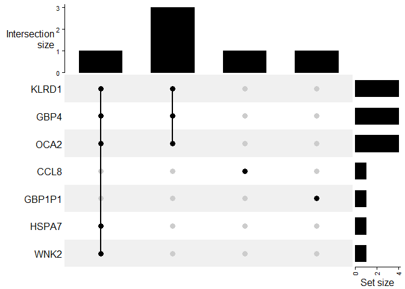

```r
library(tidyverse)
```

```
## Warning: пакет 'tidyverse' был собран под R версии 4.2.2
```

```
## ── Attaching packages ─────────────────────────────────────── tidyverse 1.3.2 ──
## ✔ ggplot2 3.3.6      ✔ purrr   0.3.5 
## ✔ tibble  3.1.8      ✔ dplyr   1.0.10
## ✔ tidyr   1.2.1      ✔ stringr 1.4.1 
## ✔ readr   2.1.3      ✔ forcats 0.5.2
```

```
## Warning: пакет 'readr' был собран под R версии 4.2.2
```

```
## Warning: пакет 'dplyr' был собран под R версии 4.2.2
```

```
## Warning: пакет 'forcats' был собран под R версии 4.2.2
```

```
## ── Conflicts ────────────────────────────────────────── tidyverse_conflicts() ──
## ✖ dplyr::filter() masks stats::filter()
## ✖ dplyr::lag()    masks stats::lag()
```

```r
library(gtsummary)
```

```
## Warning: пакет 'gtsummary' был собран под R версии 4.2.2
```

```
## #BlackLivesMatter
```

```r
library(ggplot2)
library(ggpubr)
library(dplyr)
library(tibble)
library(matrixStats)
```

```
## Warning: пакет 'matrixStats' был собран под R версии 4.2.2
```

```
## 
## Присоединяю пакет: 'matrixStats'
## 
## Следующий объект скрыт от 'package:dplyr':
## 
##     count
```

```r
library(survival)
library(survminer)
```

```
## Warning: пакет 'survminer' был собран под R версии 4.2.2
```

```
## 
## Присоединяю пакет: 'survminer'
## 
## Следующий объект скрыт от 'package:survival':
## 
##     myeloma
```

```r
library(glmnet)
```

```
## Warning: пакет 'glmnet' был собран под R версии 4.2.2
```

```
## Загрузка требуемого пакета: Matrix
## 
## Присоединяю пакет: 'Matrix'
## 
## Следующие объекты скрыты от 'package:tidyr':
## 
##     expand, pack, unpack
## 
## Loaded glmnet 4.1-6
```


#*OS-DDS*

##Data-preprocessing


Данные пациентов:


```r
patients <- read_tsv("data_clinical_patient.txt", skip = 4)#исходные данные
patients <- patients %>%
  select("PATIENT_ID", "OS_STATUS", "OS_MONTHS", "DSS_STATUS")%>%
  filter(!(DSS_STATUS=="0:ALIVE OR DEAD TUMOR FREE" & OS_STATUS == "1:DECEASED"))%>%
  select(!"DSS_STATUS")%>%
  na.omit()%>%
  mutate(`OS_STATUS` = ifelse(`OS_STATUS` == "1:DECEASED", 1, 0))
colnames(patients) <- c("ID", "status", "time")
```


Данные образцов:


```r
samples <- read_tsv("data_clinical_sample.txt", skip = 4)#исходные данные
```

```
## Rows: 448 Columns: 18
## ── Column specification ────────────────────────────────────────────────────────
## Delimiter: "\t"
## chr (13): PATIENT_ID, SAMPLE_ID, ONCOTREE_CODE, CANCER_TYPE, CANCER_TYPE_DET...
## dbl  (4): ANEUPLOIDY_SCORE, MSI_SCORE_MANTIS, MSI_SENSOR_SCORE, TMB_NONSYNON...
## lgl  (1): GRADE
## 
## ℹ Use `spec()` to retrieve the full column specification for this data.
## ℹ Specify the column types or set `show_col_types = FALSE` to quiet this message.
```

```r
samples <- samples %>%
  select("PATIENT_ID", "SAMPLE_ID", "SAMPLE_TYPE")

Msamp <- samples %>%
  filter(`SAMPLE_TYPE` == "Metastasis") %>%
  select(!"SAMPLE_TYPE")#367
colnames(Msamp) <- c("ID", "SampID")
#проверка дубликатов среди пациентов
if(length(unique(Msamp$ID)) != nrow(Msamp)){
   print("Есть дубликаты среди пациентов")
   }
```


Оставляем пациентов с метастазами:


```r
Msamp <- inner_join(Msamp, patients, by = "ID") %>%
  select(!"ID")
```


Данные mRNA:


```r
mRNA_raw <- read_tsv("data_mrna_seq_v2_rsem.txt")
```

```
## Rows: 20531 Columns: 445
## ── Column specification ────────────────────────────────────────────────────────
## Delimiter: "\t"
## chr   (1): Hugo_Symbol
## dbl (444): Entrez_Gene_Id, TCGA-3N-A9WB-06, TCGA-3N-A9WC-06, TCGA-3N-A9WD-06...
## 
## ℹ Use `spec()` to retrieve the full column specification for this data.
## ℹ Specify the column types or set `show_col_types = FALSE` to quiet this message.
```

```r
mRNA <- mRNA_raw %>%
  select(!Hugo_Symbol)
mRNA <- mRNA[!duplicated(mRNA$Entrez_Gene_Id), ]

#транспонирование
mRNA <- t(mRNA) %>%
  as.data.frame()
colnames(mRNA) <- mRNA[1,]
mRNA$SampID <- row.names(mRNA)
mRNA <- mRNA[-1,] %>%
  select(SampID, everything())

#оставляем только нужные образцы (метастазы)
MmRNA <- inner_join(Msamp, mRNA, by = "SampID") %>%
  select(!c("status", "time"))
```


Оставим для анализа 1500 самых вариабельных генов и преобразуем данные:


```r
MmRNA_num <- MmRNA %>%
  select(where(is.numeric))%>%
  select(function(x) sum(x) != 0)%>%
  select(function(x) mad(x) != 0)
MmRNA_transf <- log2(MmRNA_num + 1)
MmRNA_scaled <- apply(MmRNA_transf, 2, function(x) (x - median(x))/mad(x))

genes <- 
  apply(MmRNA_transf, 2, mad) %>%
  sort(decreasing = T) %>%
  .[1:1500] %>%
  names()
MmRNA_res <- MmRNA_transf[, genes]

Msurv_res <- Msamp %>%
  select(!`SampID`)
```


##Glmnet


```r
y<-Msurv_res
x<-MmRNA_res
```


Исходно Каплан-Мейер: 


```r
fit.surv <- survfit(Surv(time, status) ~ 1, 
                    data = y)
ggsurvplot(fit.surv,conf.int=TRUE)
```

<!-- -->


Тест и трейн сплит (20:80)

```r
set.seed(114)

indexes_tr <- sample(1:nrow(y),size=round(nrow(y)*0.8))
indexes_te <- setdiff(c(1:nrow(y)), indexes_tr)#существуют только в первом векторе

xtrain_ns <- x[indexes_tr,]
ytrain <- y[indexes_tr,]
xtest_ns <- x[indexes_te,]
ytest <- y[indexes_te,]
```


скейлим x отдельно для тест и трейн


```r
xtrain <- apply(xtrain_ns, 2, function(x) (x - median(x))/mad(x))
xtest <- apply(xtest_ns, 2, function(x) (x - median(x))/mad(x))
```


Что происходит с коэффициентами по мере роста штрафа:


```r
set.seed(89)
ytrain.surv <- Surv(ytrain$time,ytrain$status)
fit.coxnet <- glmnet(xtrain, ytrain.surv, family = "cox",alpha=0.95)
plot(fit.coxnet,xvar="lambda")
```

<!-- -->


Выбор лямбды (штрафа) с помощью кросс-валидации:


```r
cv.coxnet <- cv.glmnet(xtrain,ytrain.surv,
                       family="cox",
                       type.measure="C",
                       nfolds = 5,
                       alpha=0.95)
plot(cv.coxnet)
```

<!-- -->

```r
cv.coxnet
```

```
## 
## Call:  cv.glmnet(x = xtrain, y = ytrain.surv, type.measure = "C", nfolds = 5,      family = "cox", alpha = 0.95) 
## 
## Measure: C-index 
## 
##      Lambda Index Measure      SE Nonzero
## min 0.05229    32  0.6289 0.02756      78
## 1se 0.18362     5  0.6041 0.04981       3
```


График ненулевых коэффициентов (1se):


```r
dbeta <- data.frame(betahat=as.numeric(coef(fit.coxnet,s=cv.coxnet$lambda.1se)))
dbeta$betaname <- colnames(x)
dbeta%>%
  filter(betahat!=0)%>%
  ggplot(.,aes(x=reorder(betaname,abs(betahat)),y=abs(betahat)))+
  geom_bar(stat="identity",width=0.5)+
  xlab("gene")+ylab("abs(betahat)")+
  theme_bw()+
  theme(axis.text.x = element_text(angle = 90, vjust = 0.5,size=7),
        text = element_text(size = 15))
```

<!-- -->

3824 - KLRD1 killer cell lectin like receptor D1
115361 - GBP4 guanylate binding protein 4
4948 - OCA2 OCA2 melanosomal transmembrane protein


Предсказание коэффициентов $x^{T}\beta$ (>0 <-> poor):


```r
lin_coef <- predict(fit.coxnet,
              newx=xtest,
              s=cv.coxnet$lambda.1se,
              type="link")
Res_lc<-ytest
Res_lc$lin_coef <- lin_coef
Res_lc$prognosis <- ifelse(lin_coef>0,"poor","good")
ggsurvplot(survfit(Surv(time, status) ~ prognosis, 
                    data = Res_lc),conf.int = TRUE)
```

<!-- -->


Предсказание относительного риска по Коксу (>1 <-> poor):


```r
hazard <- predict(fit.coxnet,
              newx=xtest,
              s=cv.coxnet$lambda.1se,
              type="response")
Res_haz<-ytest
Res_haz$hazard <- hazard
Res_haz$prognosis <- ifelse(hazard>1,"poor","good")
ggsurvplot(survfit(Surv(time, status) ~ prognosis, 
                    data = Res_haz),conf.int = TRUE)
```

<!-- -->


--------------

#*Primary*

##Data-preprocessing


Данные пациентов:


```r
patients <- read_tsv("data_clinical_patient.txt", skip = 4)#исходные данные
patients <- patients %>%
  select("PATIENT_ID", "OS_STATUS", "OS_MONTHS", "DSS_STATUS")%>%
  filter(!(DSS_STATUS=="0:ALIVE OR DEAD TUMOR FREE" & OS_STATUS == "1:DECEASED"))%>%
  select(!"DSS_STATUS")%>%
  na.omit()%>%
  mutate(`OS_STATUS` = ifelse(`OS_STATUS` == "1:DECEASED", 1, 0))
colnames(patients) <- c("ID", "status", "time")
```


Данные образцов:


```r
samples <- read_tsv("data_clinical_sample.txt", skip = 4)#исходные данные
```

```
## Rows: 448 Columns: 18
## ── Column specification ────────────────────────────────────────────────────────
## Delimiter: "\t"
## chr (13): PATIENT_ID, SAMPLE_ID, ONCOTREE_CODE, CANCER_TYPE, CANCER_TYPE_DET...
## dbl  (4): ANEUPLOIDY_SCORE, MSI_SCORE_MANTIS, MSI_SENSOR_SCORE, TMB_NONSYNON...
## lgl  (1): GRADE
## 
## ℹ Use `spec()` to retrieve the full column specification for this data.
## ℹ Specify the column types or set `show_col_types = FALSE` to quiet this message.
```

```r
samples <- samples %>%
  select("PATIENT_ID", "SAMPLE_ID", "SAMPLE_TYPE")

Msamp <- samples %>%
  filter(`SAMPLE_TYPE` == "Primary") %>%
  select(!"SAMPLE_TYPE")#367
colnames(Msamp) <- c("ID", "SampID")
#проверка дубликатов среди пациентов
if(length(unique(Msamp$ID)) != nrow(Msamp)){
   print("Есть дубликаты среди пациентов")
   }
```


Оставляем пациентов с первичными опухолями:


```r
Msamp <- inner_join(Msamp, patients, by = "ID") %>%
  select(!"ID")
```


Данные mRNA:


```r
mRNA_raw <- read_tsv("data_mrna_seq_v2_rsem.txt")
```

```
## Rows: 20531 Columns: 445
## ── Column specification ────────────────────────────────────────────────────────
## Delimiter: "\t"
## chr   (1): Hugo_Symbol
## dbl (444): Entrez_Gene_Id, TCGA-3N-A9WB-06, TCGA-3N-A9WC-06, TCGA-3N-A9WD-06...
## 
## ℹ Use `spec()` to retrieve the full column specification for this data.
## ℹ Specify the column types or set `show_col_types = FALSE` to quiet this message.
```

```r
mRNA <- mRNA_raw %>%
  select(!Hugo_Symbol)
mRNA <- mRNA[!duplicated(mRNA$Entrez_Gene_Id), ]

#транспонирование
mRNA <- t(mRNA) %>%
  as.data.frame()
colnames(mRNA) <- mRNA[1,]
mRNA$SampID <- row.names(mRNA)
mRNA <- mRNA[-1,] %>%
  select(SampID, everything())

#оставляем только нужные образцы (первичные)
MmRNA <- inner_join(Msamp, mRNA, by = "SampID") %>%
  select(!c("status", "time"))
Msamp <- inner_join(mRNA, Msamp, by = "SampID")%>%
  select(c("SampID", "status", "time"))
```


Оставим для анализа 1500 самых вариабельных генов и преобразуем данные:


```r
MmRNA_num <- MmRNA %>%
  select(where(is.numeric))%>%
  select(function(x) sum(x) != 0)%>%
  select(function(x) mad(x) != 0)
MmRNA_transf <- log2(MmRNA_num + 1)
MmRNA_scaled <- apply(MmRNA_transf, 2, function(x) (x - median(x))/mad(x))

genes <- 
  apply(MmRNA_transf, 2, mad) %>%
  sort(decreasing = T) %>%
  .[1:1500] %>%
  names()
MmRNA_res <- MmRNA_transf[, genes]

Msurv_res <- Msamp %>%
  select(!`SampID`)
```


##Glmnet


```r
y<-Msurv_res %>%
  filter(time > 0)
x<-MmRNA_res
```


Исходно Каплан-Мейер: 


```r
fit.surv <- survfit(Surv(time, status) ~ 1, 
                    data = y)
ggsurvplot(fit.surv,conf.int=TRUE)
```

<!-- -->


Тест и трейн сплит (10:90)

```r
set.seed(114)

indexes_tr <- sample(1:nrow(y),size=round(nrow(y)*0.9))
indexes_te <- setdiff(c(1:nrow(y)), indexes_tr)#существуют только в первом векторе

xtrain_ns <- x[indexes_tr,]
ytrain <- y[indexes_tr,]
xtest_ns <- x[indexes_te,]
ytest <- y[indexes_te,]
```


скейлим x отдельно для тест и трейн


```r
xtrain <- apply(xtrain_ns, 2, function(x) (x - median(x))/mad(x))
xtest <- apply(xtest_ns, 2, function(x) (x - median(x))/mad(x))
```


Что происходит с коэффициентами по мере роста штрафа:


```r
set.seed(89)
ytrain.surv <- Surv(ytrain$time,ytrain$status)
fit.coxnet <- glmnet(xtrain, ytrain.surv, family = "cox",alpha=0.95)
plot(fit.coxnet,xvar="lambda")
```

<!-- -->


Выбор лямбды (штрафа) с помощью кросс-валидации:


```r
cv.coxnet <- cv.glmnet(xtrain,ytrain.surv,
                       family="cox",
                       type.measure="C",
                       nfolds = 5,
                       alpha=0.95)
plot(cv.coxnet)
```

<!-- -->

```r
cv.coxnet
```

```
## 
## Call:  cv.glmnet(x = xtrain, y = ytrain.surv, type.measure = "C", nfolds = 5,      family = "cox", alpha = 0.95) 
## 
## Measure: C-index 
## 
##      Lambda Index Measure     SE Nonzero
## min 0.05663    31  0.5745 0.1172      26
## 1se 0.21822     2  0.4748 0.1121       3
```


График ненулевых коэффициентов (1se):


```r
dbeta <- data.frame(betahat=as.numeric(coef(fit.coxnet,s=cv.coxnet$lambda.1se)))
dbeta$betaname <- colnames(x)
dbeta%>%
  filter(betahat!=0)%>%
  ggplot(.,aes(x=reorder(betaname,abs(betahat)),y=abs(betahat)))+
  geom_bar(stat="identity",width=0.5)+
  xlab("gene")+ylab("abs(betahat)")+
  theme_bw()+
  theme(axis.text.x = element_text(angle = 90, vjust = 0.5,size=7),
        text = element_text(size = 15))
```

<!-- -->

1496 - CTNNA2 catenin alpha 2 
5457 - POU4F1 POU class 4 homeobox 1
54550 - NECAB2 N-terminal EF-hand calcium binding protein 2


Предсказание коэффициентов $x^{T}\beta$ (>0 <-> poor):


```r
lin_coef <- predict(fit.coxnet,
              newx=xtest,
              s=cv.coxnet$lambda.1se,
              type="link")
Res_lc<-ytest
Res_lc$lin_coef <- lin_coef
Res_lc$prognosis <- ifelse(lin_coef>0,"poor","good")
ggsurvplot(survfit(Surv(time, status) ~ prognosis, 
                    data = Res_lc),conf.int = TRUE)
```

<!-- -->


Предсказание относительного риска по Коксу (>1 <-> poor):


```r
hazard <- predict(fit.coxnet,
              newx=xtest,
              s=cv.coxnet$lambda.1se,
              type="response")
Res_haz<-ytest
Res_haz$hazard <- hazard
Res_haz$prognosis <- ifelse(hazard>1,"poor","good")
ggsurvplot(survfit(Surv(time, status) ~ prognosis, 
                    data = Res_haz),conf.int = TRUE)
```

<!-- -->


---------------
#*дожили до 10 лет (120 месяцев)*

##Data-preprocessing


Данные пациентов:


```r
patients <- read_tsv("data_clinical_patient.txt", skip = 4)#исходные данные
patients <- patients %>%
  select("PATIENT_ID", "OS_STATUS", "OS_MONTHS", "DSS_STATUS")%>%
  filter(!(DSS_STATUS=="0:ALIVE OR DEAD TUMOR FREE" & OS_STATUS == "1:DECEASED"))%>%
  select(!"DSS_STATUS")%>%
  na.omit()%>%
  mutate(`OS_STATUS` = ifelse(`OS_STATUS` == "1:DECEASED", 1, 0))
colnames(patients) <- c("ID", "status", "time")
patients <- patients %>%
  filter(time <= 120)
```


Данные образцов:


```r
samples <- read_tsv("data_clinical_sample.txt", skip = 4)#исходные данные
```

```
## Rows: 448 Columns: 18
## ── Column specification ────────────────────────────────────────────────────────
## Delimiter: "\t"
## chr (13): PATIENT_ID, SAMPLE_ID, ONCOTREE_CODE, CANCER_TYPE, CANCER_TYPE_DET...
## dbl  (4): ANEUPLOIDY_SCORE, MSI_SCORE_MANTIS, MSI_SENSOR_SCORE, TMB_NONSYNON...
## lgl  (1): GRADE
## 
## ℹ Use `spec()` to retrieve the full column specification for this data.
## ℹ Specify the column types or set `show_col_types = FALSE` to quiet this message.
```

```r
samples <- samples %>%
  select("PATIENT_ID", "SAMPLE_ID", "SAMPLE_TYPE")

Msamp <- samples %>%
  filter(`SAMPLE_TYPE` == "Metastasis") %>%
  select(!"SAMPLE_TYPE")#367
colnames(Msamp) <- c("ID", "SampID")
#проверка дубликатов среди пациентов
if(length(unique(Msamp$ID)) != nrow(Msamp)){
   print("Есть дубликаты среди пациентов")
   }
```


Оставляем пациентов с метастазами:


```r
Msamp <- inner_join(Msamp, patients, by = "ID") %>%
  select(!"ID")
```


Данные mRNA:


```r
mRNA_raw <- read_tsv("data_mrna_seq_v2_rsem.txt")
```

```
## Rows: 20531 Columns: 445
## ── Column specification ────────────────────────────────────────────────────────
## Delimiter: "\t"
## chr   (1): Hugo_Symbol
## dbl (444): Entrez_Gene_Id, TCGA-3N-A9WB-06, TCGA-3N-A9WC-06, TCGA-3N-A9WD-06...
## 
## ℹ Use `spec()` to retrieve the full column specification for this data.
## ℹ Specify the column types or set `show_col_types = FALSE` to quiet this message.
```

```r
mRNA <- mRNA_raw %>%
  select(!Hugo_Symbol)
mRNA <- mRNA[!duplicated(mRNA$Entrez_Gene_Id), ]

#транспонирование
mRNA <- t(mRNA) %>%
  as.data.frame()
colnames(mRNA) <- mRNA[1,]
mRNA$SampID <- row.names(mRNA)
mRNA <- mRNA[-1,] %>%
  select(SampID, everything())

#оставляем только нужные образцы (метастазы)
MmRNA <- inner_join(Msamp, mRNA, by = "SampID") %>%
  select(!c("status", "time"))
```


Оставим для анализа 1500 самых вариабельных генов и преобразуем данные:


```r
MmRNA_num <- MmRNA %>%
  select(where(is.numeric))%>%
  select(function(x) sum(x) != 0)%>%
  select(function(x) mad(x) != 0)
MmRNA_transf <- log2(MmRNA_num + 1)
MmRNA_scaled <- apply(MmRNA_transf, 2, function(x) (x - median(x))/mad(x))

genes <- 
  apply(MmRNA_transf, 2, mad) %>%
  sort(decreasing = T) %>%
  .[1:1500] %>%
  names()
MmRNA_res <- MmRNA_transf[, genes]

Msurv_res <- Msamp %>%
  select(!`SampID`)
```


##Glmnet


```r
y<-Msurv_res
x<-MmRNA_res
```


Исходно Каплан-Мейер: 


```r
fit.surv <- survfit(Surv(time, status) ~ 1, 
                    data = y)
ggsurvplot(fit.surv,conf.int=FALSE)
```

<!-- -->


Тест и трейн сплит (20:80)

```r
set.seed(114)

indexes_tr <- sample(1:nrow(y),size=round(nrow(y)*0.8))
indexes_te <- setdiff(c(1:nrow(y)), indexes_tr)#существуют только в первом векторе

xtrain_ns <- x[indexes_tr,]
ytrain <- y[indexes_tr,]
xtest_ns <- x[indexes_te,]
ytest <- y[indexes_te,]
```


скейлим x отдельно для тест и трейн


```r
xtrain <- apply(xtrain_ns, 2, function(x) (x - median(x))/mad(x))
xtest <- apply(xtest_ns, 2, function(x) (x - median(x))/mad(x))
```


Что происходит с коэффициентами по мере роста штрафа:


```r
set.seed(89)
ytrain.surv <- Surv(ytrain$time,ytrain$status)
fit.coxnet <- glmnet(xtrain, ytrain.surv, family = "cox",alpha=0.95)
plot(fit.coxnet,xvar="lambda")
```

<!-- -->


Выбор лямбды (штрафа) с помощью кросс-валидации:


```r
cv.coxnet <- cv.glmnet(xtrain,ytrain.surv,
                       family="cox",
                       type.measure="C",
                       nfolds = 5,
                       alpha=0.95)
plot(cv.coxnet)
```

<!-- -->

```r
cv.coxnet
```

```
## 
## Call:  cv.glmnet(x = xtrain, y = ytrain.surv, type.measure = "C", nfolds = 5,      family = "cox", alpha = 0.95) 
## 
## Measure: C-index 
## 
##     Lambda Index Measure      SE Nonzero
## min 0.1797     7  0.5785 0.04287       5
## 1se 0.2267     2  0.5507 0.03709       1
```


График ненулевых коэффициентов (1se):


```r
dbeta <- data.frame()
dbeta <- data.frame(betahat=as.numeric(coef(fit.coxnet,s=cv.coxnet$lambda.1se)))
dbeta$betaname <- colnames(x)
dbeta%>%
  dplyr::filter(betahat!=0)%>%
  ggplot(.,aes(x=reorder(betaname,abs(betahat)),y=abs(betahat)))+
  geom_bar(stat="identity",width=0.5)+
  xlab("gene")+ylab("abs(betahat)")+
  theme_bw()+
  theme(axis.text.x = element_text(angle = 90, vjust = 0.5,size=7),
        text = element_text(size = 15))
```

<!-- -->

3824 - KLRD1 killer cell lectin like receptor D1
115361 - GBP4 guanylate binding protein 4
4948 - OCA2 OCA2 melanosomal transmembrane protein


Предсказание коэффициентов $x^{T}\beta$ (>0 <-> poor):


```r
lin_coef <- predict(fit.coxnet,
              newx=xtest,
              s=cv.coxnet$lambda.1se,
              type="link")
Res_lc<-ytest
Res_lc$lin_coef <- lin_coef
Res_lc$prognosis <- ifelse(lin_coef>0,"poor","good")
ggsurvplot(survfit(Surv(time, status) ~ prognosis, 
                    data = Res_lc),conf.int = TRUE)
```

<!-- -->


Предсказание относительного риска по Коксу (>1 <-> poor):


```r
hazard <- predict(fit.coxnet,
              newx=xtest,
              s=cv.coxnet$lambda.1se,
              type="response")
Res_haz<-ytest
Res_haz$hazard <- hazard
Res_haz$prognosis <- ifelse(hazard>1,"poor","good")
ggsurvplot(survfit(Surv(time, status) ~ prognosis, 
                    data = Res_haz),conf.int = TRUE)
```

<!-- -->


-------------

#*log-mad*

##Data-preprocessing


Данные пациентов:


```r
patients <- read_tsv("data_clinical_patient.txt", skip = 4)#исходные данные
patients <- patients %>%
  select("PATIENT_ID", "OS_STATUS", "OS_MONTHS")%>%
  na.omit()%>%
  mutate(`OS_STATUS` = ifelse(`OS_STATUS` == "1:DECEASED", 1, 0))
colnames(patients) <- c("ID", "status", "time")
```


Данные образцов:


```r
samples <- read_tsv("data_clinical_sample.txt", skip = 4)#исходные данные
```

```
## Rows: 448 Columns: 18
## ── Column specification ────────────────────────────────────────────────────────
## Delimiter: "\t"
## chr (13): PATIENT_ID, SAMPLE_ID, ONCOTREE_CODE, CANCER_TYPE, CANCER_TYPE_DET...
## dbl  (4): ANEUPLOIDY_SCORE, MSI_SCORE_MANTIS, MSI_SENSOR_SCORE, TMB_NONSYNON...
## lgl  (1): GRADE
## 
## ℹ Use `spec()` to retrieve the full column specification for this data.
## ℹ Specify the column types or set `show_col_types = FALSE` to quiet this message.
```

```r
samples <- samples %>%
  select("PATIENT_ID", "SAMPLE_ID", "SAMPLE_TYPE")

Msamp <- samples %>%
  filter(`SAMPLE_TYPE` == "Metastasis") %>%
  select(!"SAMPLE_TYPE")#367
colnames(Msamp) <- c("ID", "SampID")
#проверка дубликатов среди пациентов
if(length(unique(Msamp$ID)) != nrow(Msamp)){
   print("Есть дубликаты среди пациентов")
   }
```


Оставляем пациентов с метастазами:


```r
Msamp <- inner_join(Msamp, patients, by = "ID") %>%
  select(!"ID")
```


Данные mRNA:


```r
mRNA_raw <- read_tsv("data_mrna_seq_v2_rsem.txt")
```

```
## Rows: 20531 Columns: 445
## ── Column specification ────────────────────────────────────────────────────────
## Delimiter: "\t"
## chr   (1): Hugo_Symbol
## dbl (444): Entrez_Gene_Id, TCGA-3N-A9WB-06, TCGA-3N-A9WC-06, TCGA-3N-A9WD-06...
## 
## ℹ Use `spec()` to retrieve the full column specification for this data.
## ℹ Specify the column types or set `show_col_types = FALSE` to quiet this message.
```

```r
mRNA <- mRNA_raw %>%
  select(!Hugo_Symbol)
mRNA <- mRNA[!duplicated(mRNA$Entrez_Gene_Id), ]

#транспонирование
mRNA <- t(mRNA) %>%
  as.data.frame()
colnames(mRNA) <- mRNA[1,]
mRNA$SampID <- row.names(mRNA)
mRNA <- mRNA[-1,] %>%
  select(SampID, everything())

#оставляем только нужные образцы (метастазы)
MmRNA <- inner_join(Msamp, mRNA, by = "SampID") %>%
  select(!c("status", "time"))
```


Оставим для анализа 1500 самых вариабельных генов и преобразуем данные:


```r
MmRNA_num <- MmRNA %>%
  select(where(is.numeric))%>%
  select(function(x) sum(x) != 0)%>%
  select(function(x) mad(x) != 0)
MmRNA_transf <- log2(MmRNA_num + 1)
MmRNA_scaled <- apply(MmRNA_transf, 2, function(x) (x - median(x))/mad(x))

genes <- 
  apply(MmRNA_transf, 2, mad) %>%
  sort(decreasing = T) %>%
  .[1:1500] %>%
  names()
MmRNA_res <- MmRNA_transf[, genes]

Msurv_res <- Msamp %>%
  select(!`SampID`)
```


##Glmnet


```r
y<-Msurv_res
x<-MmRNA_res
```


Исходно Каплан-Мейер: 


```r
fit.surv <- survfit(Surv(time, status) ~ 1, 
                    data = y)
ggsurvplot(fit.surv,conf.int=FALSE)
```

<!-- -->


Тест и трейн сплит (20:80)

```r
set.seed(114)

indexes_tr <- sample(1:nrow(y),size=round(nrow(y)*0.8))
indexes_te <- setdiff(c(1:nrow(y)), indexes_tr)#существуют только в первом векторе

xtrain_ns <- x[indexes_tr,]
ytrain <- y[indexes_tr,]
xtest_ns <- x[indexes_te,]
ytest <- y[indexes_te,]
```


скейлим x отдельно для тест и трейн


```r
xtrain <- apply(xtrain_ns, 2, function(x) (x - median(x))/mad(x))
xtest <- apply(xtest_ns, 2, function(x) (x - median(x))/mad(x))
```


Что происходит с коэффициентами по мере роста штрафа:


```r
set.seed(89)
ytrain.surv <- Surv(ytrain$time,ytrain$status)
fit.coxnet <- glmnet(xtrain, ytrain.surv, family = "cox",alpha=0.95)
plot(fit.coxnet,xvar="lambda")
```

<!-- -->


Выбор лямбды (штрафа) с помощью кросс-валидации:


```r
cv.coxnet <- cv.glmnet(xtrain,ytrain.surv,
                       family="cox",
                       type.measure="C",
                       nfolds = 5,
                       alpha=0.95)
plot(cv.coxnet)
```

<!-- -->

```r
cv.coxnet
```

```
## 
## Call:  cv.glmnet(x = xtrain, y = ytrain.surv, type.measure = "C", nfolds = 5,      family = "cox", alpha = 0.95) 
## 
## Measure: C-index 
## 
##     Lambda Index Measure      SE Nonzero
## min 0.1672    10  0.6330 0.02270       6
## 1se 0.2315     3  0.6247 0.02121       1
```


Only deviance, C available as type.measure for Cox models


График ненулевых коэффициентов (1se)


```r
dbeta <- data.frame()
dbeta <- data.frame(betahat=as.numeric(coef(fit.coxnet,s=cv.coxnet$lambda.1se)))
dbeta$betaname <- colnames(x)
dbeta%>%
  dplyr::filter(betahat!=0)%>%
  ggplot(.,aes(x=reorder(betaname,abs(betahat)),y=abs(betahat)))+
  geom_bar(stat="identity",width=0.5)+
  xlab("gene")+ylab("abs(betahat)")+
  theme_bw()+
  theme(axis.text.x = element_text(angle = 90, vjust = 0.5,size=7),
        text = element_text(size = 15))
```

<!-- -->


График ненулевых коэффициентов (min)


```r
dbeta <- data.frame()
dbeta <- data.frame(betahat=as.numeric(coef(fit.coxnet,s=cv.coxnet$lambda.min)))
dbeta$betaname <- colnames(x)
dbeta%>%
  dplyr::filter(betahat!=0)%>%
  ggplot(.,aes(x=reorder(betaname,abs(betahat)),y=abs(betahat)))+
  geom_bar(stat="identity",width=0.5)+
  xlab("gene")+ylab("abs(betahat)")+
  theme_bw()+
  theme(axis.text.x = element_text(angle = 90, vjust = 0.5,size=7),
        text = element_text(size = 15))
```

<!-- -->

Предсказания $x^{T}\beta$ (деление на poor/good ><0) :


```r
lin_coef <- predict(fit.coxnet,
              newx=xtest,
              s=cv.coxnet$lambda.min,
              type="link")
Res_lc<-ytest
Res_lc$lin_coef <- lin_coef
Res_lc$prognosis <- ifelse(lin_coef>0,"poor","good")
ggsurvplot(survfit(Surv(time, status) ~ prognosis, 
                    data = Res_lc),conf.int = TRUE)
```

<!-- -->


```r
lin_coef <- predict(fit.coxnet,
              newx=xtest,
              s=cv.coxnet$lambda.min,
              type="link")
Res_lc<-ytest
Res_lc$lin_coef <- lin_coef
Res_lc$prognosis <- ifelse(lin_coef>0,"poor","good")
ggsurvplot(survfit(Surv(time, status) ~ prognosis, 
                    data = Res_lc),conf.int = TRUE)
```

<!-- -->


Предсказания hazards (деление на poor/good ><1):


```r
hazard <- predict(fit.coxnet,
              newx=xtest,
              s=cv.coxnet$lambda.min,
              type="response")
Res_haz<-ytest
Res_haz$hazard <- hazard
Res_haz$prognosis <- ifelse(hazard>1,"poor","good")
ggsurvplot(survfit(Surv(time, status) ~ prognosis, 
                    data = Res_haz),conf.int = TRUE)
```

<!-- -->

------------
#*log-scale*


##Data-preprocessing


Данные пациентов:


```r
patients <- read_tsv("data_clinical_patient.txt", skip = 4)#исходные данные
patients <- patients %>%
  select("PATIENT_ID", "OS_STATUS", "OS_MONTHS")%>%
  na.omit()%>%
  mutate(`OS_STATUS` = ifelse(`OS_STATUS` == "1:DECEASED", 1, 0))
colnames(patients) <- c("ID", "status", "time")
```


Данные образцов:


```r
samples <- read_tsv("data_clinical_sample.txt", skip = 4)#исходные данные
```

```
## Rows: 448 Columns: 18
## ── Column specification ────────────────────────────────────────────────────────
## Delimiter: "\t"
## chr (13): PATIENT_ID, SAMPLE_ID, ONCOTREE_CODE, CANCER_TYPE, CANCER_TYPE_DET...
## dbl  (4): ANEUPLOIDY_SCORE, MSI_SCORE_MANTIS, MSI_SENSOR_SCORE, TMB_NONSYNON...
## lgl  (1): GRADE
## 
## ℹ Use `spec()` to retrieve the full column specification for this data.
## ℹ Specify the column types or set `show_col_types = FALSE` to quiet this message.
```

```r
samples <- samples %>%
  select("PATIENT_ID", "SAMPLE_ID", "SAMPLE_TYPE")

Msamp <- samples %>%
  filter(`SAMPLE_TYPE` == "Metastasis") %>%
  select(!"SAMPLE_TYPE")#367
colnames(Msamp) <- c("ID", "SampID")
#проверка дубликатов среди пациентов
if(length(unique(Msamp$ID)) != nrow(Msamp)){
   print("Есть дубликаты среди пациентов")
   }
```


Оставляем пациентов с метастазами:


```r
Msamp <- inner_join(Msamp, patients, by = "ID") %>%
  select(!"ID")
```


Данные mRNA:


```r
mRNA_raw <- read_tsv("data_mrna_seq_v2_rsem.txt")
```

```
## Rows: 20531 Columns: 445
## ── Column specification ────────────────────────────────────────────────────────
## Delimiter: "\t"
## chr   (1): Hugo_Symbol
## dbl (444): Entrez_Gene_Id, TCGA-3N-A9WB-06, TCGA-3N-A9WC-06, TCGA-3N-A9WD-06...
## 
## ℹ Use `spec()` to retrieve the full column specification for this data.
## ℹ Specify the column types or set `show_col_types = FALSE` to quiet this message.
```

```r
mRNA <- mRNA_raw %>%
  select(!Hugo_Symbol)
mRNA <- mRNA[!duplicated(mRNA$Entrez_Gene_Id), ]

#транспонирование
mRNA <- t(mRNA) %>%
  as.data.frame()
colnames(mRNA) <- mRNA[1,]
mRNA$SampID <- row.names(mRNA)
mRNA <- mRNA[-1,] %>%
  select(SampID, everything())

#оставляем только нужные образцы (метастазы)
MmRNA <- inner_join(Msamp, mRNA, by = "SampID") %>%
  select(!c("status", "time"))
```


Оставим для анализа 1500 самых вариабельных генов и преобразуем данные:


```r
MmRNA_num <- MmRNA %>%
  select(where(is.numeric))%>%
  select(function(x) sum(x) != 0)%>%
  select(function(x) sd(x) != 0)
MmRNA_transf <- log2(MmRNA_num + 1)
MmRNA_scaled <- apply(MmRNA_transf, 2, function(x) (x - mean(x))/sd(x))

genes <- 
  apply(MmRNA_transf, 2, mad) %>%
  sort(decreasing = T) %>%
  .[1:1500] %>%
  names()
MmRNA_res <- MmRNA_transf[, genes]

Msurv_res <- Msamp %>%
  select(!`SampID`)
```


##Glmnet


```r
y<-Msurv_res
x<-MmRNA_res
```


Тест и трейн сплит (20:80)

```r
set.seed(114)

indexes_tr <- sample(1:nrow(y),size=round(nrow(y)*0.8))
indexes_te <- setdiff(c(1:nrow(y)), indexes_tr)#существуют только в первом векторе

xtrain_ns <- x[indexes_tr,]
ytrain <- y[indexes_tr,]
xtest_ns <- x[indexes_te,]
ytest <- y[indexes_te,]
```


скейлим x отдельно для тест и трейн


```r
xtrain <- apply(xtrain_ns, 2, function(x) (x - mean(x))/sd(x))
xtest <- apply(xtest_ns, 2, function(x) (x - mean(x))/sd(x))
```


Что происходит с коэффициентами по мере роста штрафа:


```r
set.seed(89)
ytrain.surv <- Surv(ytrain$time,ytrain$status)
fit.coxnet <- glmnet(xtrain, ytrain.surv, family = "cox",alpha=0.95)
plot(fit.coxnet,xvar="lambda")
```

<!-- -->


Выбор лямбды (штрафа) с помощью кросс-валидации:


```r
cv.coxnet <- cv.glmnet(xtrain,ytrain.surv,
                       family="cox",
                       type.measure="C",
                       nfolds = 5,
                       alpha=0.95)
plot(cv.coxnet)
```

<!-- -->

```r
cv.coxnet
```

```
## 
## Call:  cv.glmnet(x = xtrain, y = ytrain.surv, type.measure = "C", nfolds = 5,      family = "cox", alpha = 0.95) 
## 
## Measure: C-index 
## 
##     Lambda Index Measure      SE Nonzero
## min 0.1672    10  0.6330 0.02270       6
## 1se 0.2315     3  0.6247 0.02121       1
```


Only deviance, C available as type.measure for Cox models


График ненулевых коэффициентов (1se)


```r
dbeta <- data.frame()
dbeta <- data.frame(betahat=as.numeric(coef(fit.coxnet,s=cv.coxnet$lambda.1se)))
dbeta$betaname <- colnames(x)
dbeta%>%
  dplyr::filter(betahat!=0)%>%
  ggplot(.,aes(x=reorder(betaname,abs(betahat)),y=abs(betahat)))+
  geom_bar(stat="identity",width=0.5)+
  xlab("gene")+ylab("abs(betahat)")+
  theme_bw()+
  theme(axis.text.x = element_text(angle = 90, vjust = 0.5,size=7),
        text = element_text(size = 15))
```

<!-- -->


График ненулевых коэффициентов (min)


```r
dbeta <- data.frame()
dbeta <- data.frame(betahat=as.numeric(coef(fit.coxnet,s=cv.coxnet$lambda.min)))
dbeta$betaname <- colnames(x)
dbeta%>%
  dplyr::filter(betahat!=0)%>%
  ggplot(.,aes(x=reorder(betaname,abs(betahat)),y=abs(betahat)))+
  geom_bar(stat="identity",width=0.5)+
  xlab("gene")+ylab("abs(betahat)")+
  theme_bw()+
  theme(axis.text.x = element_text(angle = 90, vjust = 0.5,size=7),
        text = element_text(size = 15))
```

<!-- -->

Предсказания (деление на poor/good в зависимости от :


```r
lp <- predict(fit.coxnet,
              newx=xtest,
              s=cv.coxnet$lambda.min,
              type="link")
dat.test <- data.frame(ytest)
dat.test$prognosis <- ifelse(lp>0,"poor","good")
fit.surv <- survfit(Surv(time, status) ~ prognosis, 
                    data = dat.test)
ggsurvplot(fit.surv,conf.int = TRUE)
```

<!-- -->

------------------


#*DSS*

##Data-preprocessing


Данные пациентов:


```r
patients <- read_tsv("data_clinical_patient.txt", skip = 4)#исходные данные
patients <- patients %>%
  select("PATIENT_ID", "DSS_STATUS", "DSS_MONTHS")%>%
  na.omit()%>%
  mutate(`DSS_STATUS` = ifelse(`DSS_STATUS` == "1:DEAD WITH TUMOR", 1, 0))
colnames(patients) <- c("ID", "status", "time")
```


Данные образцов:


```r
samples <- read_tsv("data_clinical_sample.txt", skip = 4)#исходные данные
```

```
## Rows: 448 Columns: 18
## ── Column specification ────────────────────────────────────────────────────────
## Delimiter: "\t"
## chr (13): PATIENT_ID, SAMPLE_ID, ONCOTREE_CODE, CANCER_TYPE, CANCER_TYPE_DET...
## dbl  (4): ANEUPLOIDY_SCORE, MSI_SCORE_MANTIS, MSI_SENSOR_SCORE, TMB_NONSYNON...
## lgl  (1): GRADE
## 
## ℹ Use `spec()` to retrieve the full column specification for this data.
## ℹ Specify the column types or set `show_col_types = FALSE` to quiet this message.
```

```r
samples <- samples %>%
  select("PATIENT_ID", "SAMPLE_ID", "SAMPLE_TYPE")

Msamp <- samples %>%
  filter(`SAMPLE_TYPE` == "Metastasis") %>%
  select(!"SAMPLE_TYPE")#367
colnames(Msamp) <- c("ID", "SampID")
#проверка дубликатов среди пациентов
if(length(unique(Msamp$ID)) != nrow(Msamp)){
   print("Есть дубликаты среди пациентов")
   }
```


Оставляем пациентов с метастазами:


```r
Msamp <- inner_join(Msamp, patients, by = "ID") %>%
  select(!"ID")
```


Данные mRNA:


```r
mRNA_raw <- read_tsv("data_mrna_seq_v2_rsem.txt")
```

```
## Rows: 20531 Columns: 445
## ── Column specification ────────────────────────────────────────────────────────
## Delimiter: "\t"
## chr   (1): Hugo_Symbol
## dbl (444): Entrez_Gene_Id, TCGA-3N-A9WB-06, TCGA-3N-A9WC-06, TCGA-3N-A9WD-06...
## 
## ℹ Use `spec()` to retrieve the full column specification for this data.
## ℹ Specify the column types or set `show_col_types = FALSE` to quiet this message.
```

```r
mRNA <- mRNA_raw %>%
  select(!Hugo_Symbol)
mRNA <- mRNA[!duplicated(mRNA$Entrez_Gene_Id), ]

#транспонирование
mRNA <- t(mRNA) %>%
  as.data.frame()
colnames(mRNA) <- mRNA[1,]
mRNA$SampID <- row.names(mRNA)
mRNA <- mRNA[-1,] %>%
  select(SampID, everything())

#оставляем только нужные образцы (метастазы)
MmRNA <- inner_join(Msamp, mRNA, by = "SampID") %>%
  select(!c("status", "time"))
```


Оставим для анализа 1500 самых вариабельных генов и преобразуем данные:


```r
MmRNA_num <- MmRNA %>%
  select(where(is.numeric))%>%
  select(function(x) sum(x) != 0)%>%
  select(function(x) mad(x) != 0)
MmRNA_transf <- log2(MmRNA_num + 1)
MmRNA_scaled <- apply(MmRNA_transf, 2, function(x) (x - median(x))/mad(x))

genes <- 
  apply(MmRNA_transf, 2, mad) %>%
  sort(decreasing = T) %>%
  .[1:1500] %>%
  names()
MmRNA_res <- MmRNA_transf[, genes]

Msurv_res <- Msamp %>%
  select(!`SampID`)
```


##Glmnet


```r
y<-Msurv_res
x<-MmRNA_res
```


Исходно Каплан-Мейер: 


```r
fit.surv <- survfit(Surv(time, status) ~ 1, 
                    data = y)
ggsurvplot(fit.surv,conf.int=FALSE)
```

<!-- -->


Тест и трейн сплит (20:80)

```r
set.seed(114)

indexes_tr <- sample(1:nrow(y),size=round(nrow(y)*0.8))
indexes_te <- setdiff(c(1:nrow(y)), indexes_tr)#существуют только в первом векторе

xtrain_ns <- x[indexes_tr,]
ytrain <- y[indexes_tr,]
xtest_ns <- x[indexes_te,]
ytest <- y[indexes_te,]
```


скейлим x отдельно для тест и трейн


```r
xtrain <- apply(xtrain_ns, 2, function(x) (x - median(x))/mad(x))
xtest <- apply(xtest_ns, 2, function(x) (x - median(x))/mad(x))
```


Что происходит с коэффициентами по мере роста штрафа:


```r
set.seed(89)
ytrain.surv <- Surv(ytrain$time,ytrain$status)
fit.coxnet <- glmnet(xtrain, ytrain.surv, family = "cox",alpha=0.95)
plot(fit.coxnet,xvar="lambda")
```

<!-- -->


Выбор лямбды (штрафа) с помощью кросс-валидации:


```r
cv.coxnet <- cv.glmnet(xtrain,ytrain.surv,
                       family="cox",
                       type.measure="C",
                       nfolds = 5,
                       alpha=0.95)
plot(cv.coxnet)
```

<!-- -->

```r
cv.coxnet
```

```
## 
## Call:  cv.glmnet(x = xtrain, y = ytrain.surv, type.measure = "C", nfolds = 5,      family = "cox", alpha = 0.95) 
## 
## Measure: C-index 
## 
##     Lambda Index Measure     SE Nonzero
## min  0.188     4  0.6453 0.0241       2
## 1se  0.188     4  0.6453 0.0241       2
```


График ненулевых коэффициентов (min)


```r
dbeta <- data.frame()
dbeta <- data.frame(betahat=as.numeric(coef(fit.coxnet,s=cv.coxnet$lambda.min)))
dbeta$betaname <- colnames(x)
dbeta%>%
  dplyr::filter(betahat!=0)%>%
  ggplot(.,aes(x=reorder(betaname,abs(betahat)),y=abs(betahat)))+
  geom_bar(stat="identity",width=0.5)+
  xlab("gene")+ylab("abs(betahat)")+
  theme_bw()+
  theme(axis.text.x = element_text(angle = 90, vjust = 0.5,size=7),
        text = element_text(size = 15))
```

<!-- -->

Предсказания $x^{T}\beta$ (деление на poor/good ><0) :


```r
lin_coef <- predict(fit.coxnet,
              newx=xtest,
              s=cv.coxnet$lambda.min,
              type="link")
Res_lc<-ytest
Res_lc$lin_coef <- lin_coef
Res_lc$prognosis <- ifelse(lin_coef>0,"poor","good")
ggsurvplot(survfit(Surv(time, status) ~ prognosis, 
                    data = Res_lc),conf.int = TRUE)
```

<!-- -->


Предсказания hazards (деление на poor/good ><1):


```r
hazard <- predict(fit.coxnet,
              newx=xtest,
              s=cv.coxnet$lambda.min,
              type="response")
Res_haz<-ytest
Res_haz$hazard <- hazard
Res_haz$prognosis <- ifelse(hazard>1,"poor","good")
ggsurvplot(survfit(Surv(time, status) ~ prognosis, 
                    data = Res_haz),conf.int = TRUE)
```

<!-- -->

